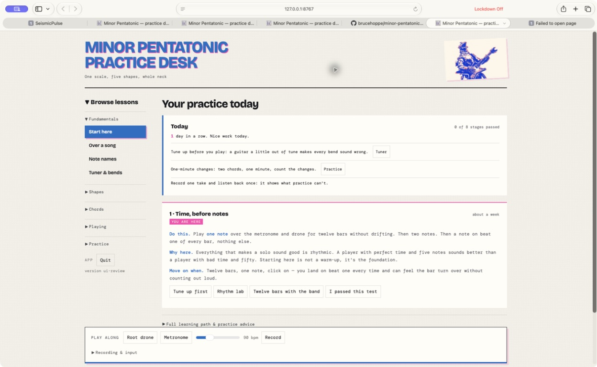
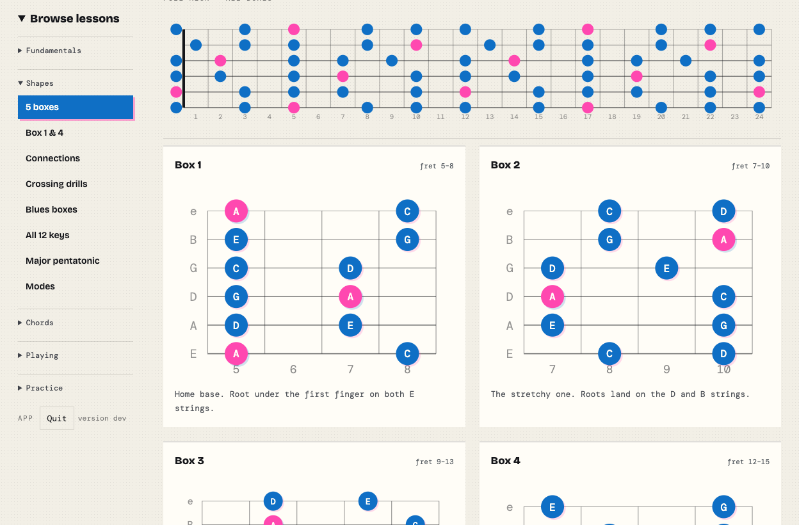
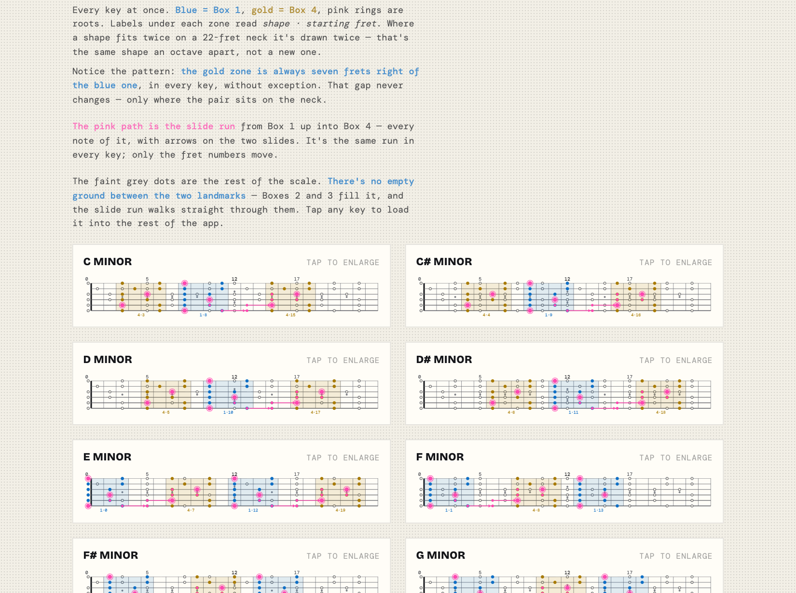
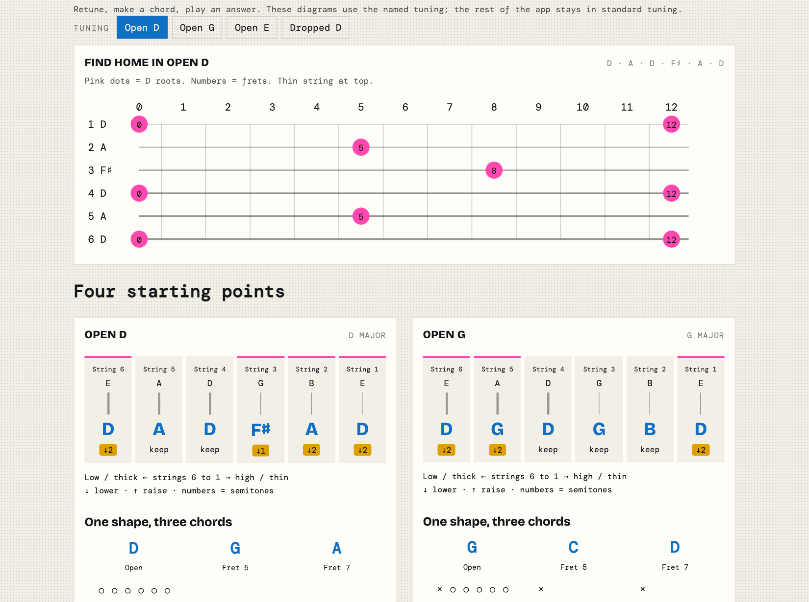
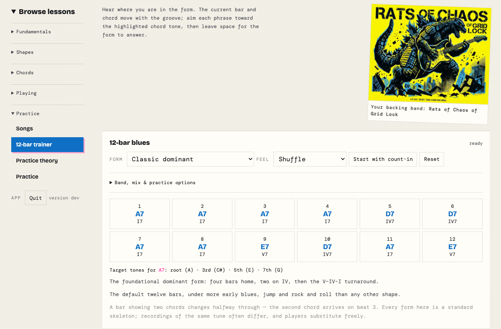
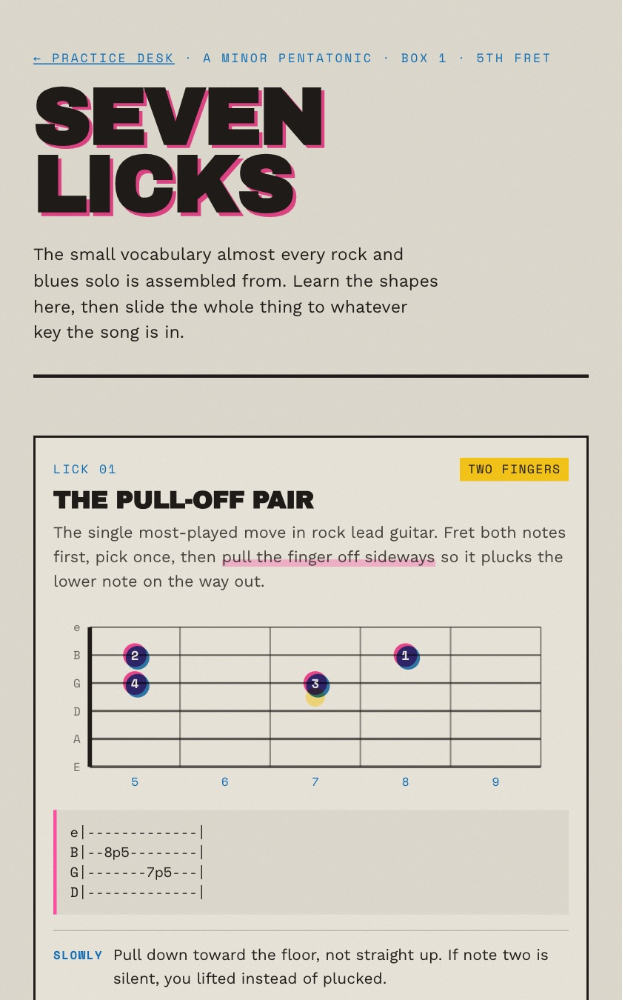

# Minor Pentatonic Practice Desk

[](https://github.com/brucehoppe/minor-pentatonic-go/actions/workflows/ci.yml)
[](https://github.com/brucehoppe/minor-pentatonic-go/releases/latest)
[](LICENSE)

**[Try it in your browser →](https://brucehoppe.github.io/minor-pentatonic-go/)** nothing to install. Or [install it](#install) to use it offline.

Coded by Bruce Hoppe

An interactive practice desk for learning the minor pentatonic scale across the whole guitar neck: the five box shapes in all 12 keys, how they connect, blues and modal colours, chords, a 12-bar trainer, a metronome and guided practice routines.

It is one small program with the whole app built in. It runs on your own computer, opens in your browser, works offline and sends nothing anywhere. It grew out of the standalone page in `reference/`.



## Install

### Windows 10 and 11

Open **PowerShell** (Start menu → type *PowerShell*) and paste:

```powershell
irm https://raw.githubusercontent.com/brucehoppe/minor-pentatonic-go/main/scripts/install.ps1 | iex
```

That downloads the latest release, checks it against the release's SHA-256
checksums, installs it for your user account, adds a Start menu shortcut and an
entry in **Settings → Apps**, and starts it.

**Permissions**

- **No administrator rights needed.** The default install goes in
  `%LOCALAPPDATA%\Programs\Minor Pentatonic`, for your account only.
- **Execution policy.** Piping into `iex`, as above, is not blocked by PowerShell's
  execution policy. If you save `install.ps1` first, Windows marks it as downloaded
  and the default policy refuses it. Either run `Unblock-File .\install.ps1` once, or
  run `powershell -ExecutionPolicy Bypass -File .\install.ps1`, which bypasses the
  policy for that run only and changes no settings.
- **Everyone on the PC.** `.\install.ps1 -Scope AllUsers` installs into Program Files.
  That needs administrator rights, so Windows shows a UAC prompt. From the
  one-line `irm … | iex` form, open PowerShell with *Run as administrator* first.
- **SmartScreen and Firewall.** The download is checked against its checksum, and
  its downloaded-from-the-internet mark is removed, so SmartScreen does not stop every
  launch. The app only listens on `127.0.0.1`, so Windows Firewall has nothing to ask.

Options, which you can combine:

```powershell
.\install.ps1 -DesktopShortcut      # also put a shortcut on the desktop
.\install.ps1 -AddToPath            # run minor-pentatonic from any terminal
.\install.ps1 -Version v2026.09.18  # a particular release
.\install.ps1 -ZipPath .\minor-pentatonic-2026.09.18-windows-11-x64.zip   # offline
.\install.ps1 -Uninstall            # or use Settings → Apps
```

To pass options to the one-line form, use
`& ([scriptblock]::Create((irm <url>))) -DesktopShortcut`.

### macOS 11 and later

Open **Terminal** (Spotlight → type *Terminal*) and paste:

```sh
curl -fsSL https://raw.githubusercontent.com/brucehoppe/minor-pentatonic-go/main/scripts/install.sh | bash
```

That downloads the latest release, checks it against the release's SHA-256
checksums, puts the app in Applications and opens it. Afterwards it is in
Launchpad and Spotlight like any other app.

**Permissions**

- **No password needed.** The app goes into `/Applications` if your account can
  write there (administrator accounts can) and otherwise into `~/Applications`.
  Add `--system` to insist on `/Applications`, which asks for an administrator
  password with `sudo` only if your account cannot write there, or `--user` to
  always use `~/Applications`.
- **Gatekeeper.** The app is signed but not notarised by Apple. A file downloaded
  with `curl` is not quarantined, so the "unidentified developer" prompt does not
  appear. The download is verified against its checksum, and so is the app's code
  signature.
- **Firewall.** The app only listens on `127.0.0.1`, so macOS has nothing to ask.

Options go after `bash -s --`, for example `… | bash -s -- --user`:

```sh
--user               # ~/Applications
--system             # /Applications, with sudo if needed
--version v2026.09.18
--zip ~/Downloads/minor-pentatonic-2026.09.18-macos.zip   # offline
--no-launch
--uninstall
```

Prefer to click? Download the `.dmg` from
[Releases](https://github.com/brucehoppe/minor-pentatonic-go/releases), open it
and drag the app to Applications. A browser download *is* quarantined, so macOS
refuses the first launch; see [Distribution packages](#distribution-packages) for
the one-time step.

### Anywhere Go is installed

```sh
go install github.com/brucehoppe/minor-pentatonic-go@latest
```

## Screenshots

| | |
|---|---|
|  |  |
| **5 boxes** — every shape across the neck, and each box on its own | **All 12 keys** — Box 1 and Box 4 in every key, with the slide run between them |
|  |  |
| **Open tunings** — where the roots sit after retuning, and how far to turn each peg | **12-bar trainer** — the form moves with the groove and names each chord's target tones |

<p align="center"><br><b>Seven Licks</b> — a supplementary written lesson</p>

## Features

- **Phrygian dominant:** a guided lesson under Playing, starting from the minor pentatonic boxes. Compare shared notes, replace the minor third, add the flat second and flat sixth, and practise short phrases over suitable backing. Five interactive diagrams follow the selected root and register; an E-example button and the original standalone reference are included. The lesson distinguishes equal-tempered guitar practice from Hijaz in maqam music and provides a slow ten-minute routine.
- **Box 1 and Box 4 landmarks:** low/high anchor shapes, root locations, relationship notes, and call-and-answer practice.
- **All 12 keys:** an interactive whole-neck chart showing both landmarks, the connecting scale tones, and slide paths.
- **Major pentatonic — the diagonal shape:** the companion scale as one continuous run up the neck, root on the A string, drawn on a vertical fretboard where the run reads as a single diagonal. Two notes on E, three on A, two on D, three on G, two on B, three on high e; arrows mark the stretch note that moves you up a position. Its own 12-key picker keeps the flat spellings (D♭ major, not C♯), and it can label the dots as note names or scale degrees. Each key names the relative minor whose box the same notes make.
- **Modes:** thirteen scales drawn as five positions each, in the same fret neighbourhoods as the pentatonic boxes — the seven major-scale modes (Ionian, Dorian, Phrygian, Lydian, Mixolydian, Aeolian, Locrian) plus harmonic minor, melodic minor, Phrygian dominant, Byzantine (double harmonic major), Hungarian minor and Lydian dominant. Every mode is drawn **parallel**, from whichever key is selected, because comparing D Dorian to C major shows they share notes but not how Dorian sounds; holding the root still and moving one note does. Each mode names the one or two notes that separate it from the major or minor scale you already know, drawn gold in every diagram, plus a whole-neck map, the chord or vamp to hear it over, and the reminder that a shape is not a mode until the harmony underneath makes it one — which is what the root drone is for.
- **Note names:** every position on all 24 frets, named. Naturals drawn solid and the sharps between them faint, because the naturals are the map. Pick any note to light up all of its occurrences, or isolate one string at a time. Six landmarks worth knowing before anything else (fret 12 repeats the open string; B–C and E–F have no sharp between them; fret 5 is the next string open, except G to B at fret 4), the five octave shapes with the G-to-B exception spelled out, a five-step drilling method, and a name-that-fret drill — because reading a name off a diagram and producing it from memory are different skills.
- **Triads:** the rung between a power chord and a scale. Major, minor, diminished and augmented, on four three-string sets, in all three inversions, close voiced and within a four-fret span so each is one hand position. Every shape carries a fingering diagram, a string-by-string table and a plain-language grip hint that names which finger goes down first and when a small barre is easier than three fingers. Every shape names which chord tone is in the bass and what that does to the sound, plus what triads unlock (chords anywhere on the neck, rhythm parts that stay out of the vocal range, solos that follow the changes, and the chord → arpeggio → scale route) and a four-step practice order ending over the 12-bar trainer.
- **Inversions:** what they are (the same chord with a different note underneath — three notes means three orders, and the slash in C/E just names the bass), a whole-neck map showing the three shapes cycling 1–2–3 up the fretboard, and the case for using them made by measurement rather than assertion: the same progression played all in root position and again with each chord taking its nearest shape, drawn on one shared fret window with the distance travelled counted. On strings 3–4–5, I–IV–I–V travels 17 frets in root position and 3 with inversions. The move itself is animated — the bottom note lifts off, swings past the other two and lands on top while they settle down one place, with the chord visibly climbing the neck alongside, and fingering for whichever step you are on. Five progressions, four string sets, plus what inversions are for (staying in one place, voice leading, choosing the bass note, controlling the top note), a five-step practice order, and the caveat that in a band a C/E over a bass player's C is a texture, not a bass note.
- **Connection drills:** ascending and descending slide runs with directional arrows and tablature.
- **Tap-to-lock maps:** isolate a box on desktop or touch devices.
- **Solo runs:** select any combination of the five boxes to form one practice zone, with the notes shared between the selected shapes lit gold as the doors between them. Tap notes on the zone map to build a run by ear, or fill it with one of five practice patterns (ascend, descend, up-and-back, sequenced fours, in thirds). The run is shown as a numbered diagram plus tab, plays back at the tempo slider's setting with each note lit as it sounds, and can be reversed, undone or cleared. Runs are stored as offsets from the zone root, so they follow the key, the register and the box selection, and persist on the device between sessions.
- **Whole-neck blues map:** the Blues boxes view opens on the entire 24-fret neck showing all five pentatonic boxes plus every ♭5, with an isolate row for any box or blues shape — each lights up in every octave it reaches, so you can see where a lick repeats.
- **Three registers:** Octave down, Standard, and Octave up. A register is a direction rather than a fixed transposition — each shape moves by whole octaves as far as the register asks and the neck allows, and a shape with nowhere to go stays at its standard position instead of disappearing. All five boxes are therefore reachable in every register and every key; only where they sit changes. Buttons state the resulting fret span and how many shapes actually moved, and the boxes view lays the cards out low to high on the neck.
- **♭5 blue note toggle:** drops the flat five into every diagram in every view as a dashed ghost note.
- **Two audio engines behind one interface:** the app asks for musical events — a note, a click, a chord strike, a drone — and a backend produces them. `webAudioEngine` synthesises live and is preferred. When the browser withholds `AudioContext` (Safari's Lockdown Mode does exactly that), `wavEngine` renders each distinct sound to band-limited PCM once, caches it as a `data:` URI and plays it through an `<audio>` element, which Lockdown Mode allows. Sound keeps working either way; the status line says which engine is in use and why. Timed parts (metronome, 12-bar trainer, rhythm lab, solo playback) book each beat on the audio clock slightly ahead of time rather than trusting `setInterval`, so beats stay even while the page is busy, and a hidden tab books further ahead.
- **Audible diagrams:** click or keyboard-activate any dot on any fretboard to hear that pitch in standard tuning.
- **Power chords:** movable two- and three-note shapes on every string root (including the three-fret G-string exception), open E5/A5/D5, a root-fret table for all 12 keys, five common progressions transposed to the selected key, palm-muting and downstroke technique, plus a fully transcribed power-chord song with tab, diagrams and form.
- **Song structure:** a section glossary with typical bar counts, and eight to-scale form timelines — verse–chorus, verse–chorus–bridge, pre-chorus, AABA, 12-bar blues, strophic, riff-driven rock, and the example song.
- **Practice tools:** drone, metronome, quizzes, generated sessions, chord-tone overlays, licks, and crossing drills.
- **Practice guide licks:** the five exercises from the personal practice guide — Box 1 and Box 2 runs, the reach into Box 2, the diagonal route between them, and the call-and-answer phrase — written as root-relative offsets so they transpose to any key, plus a root reference for both boxes.
- **Guided routines:** the two timed 25-minute practice sessions, segment by segment, each segment wired to the focus timer, with the song project, long-term focus list, finish conditions, and a device-local progress checklist.
- **Practice theory:** a six-step cold-attempt-to-delayed-retest cycle grounded in a structured guitar practice program, with actionable guidance on self-regulation, recording, spacing, external focus, interleaving, sleep and rest. The section cites the music and motor-learning evidence by DOI or PubMed identifier, labels small or indirect studies, and separates established principles from original scheduling choices.
- **Focused practice:** configurable countdowns, a ±5 bpm tempo ladder, and a device-local completed-session log.
- **12-bar trainer:** fourteen twelve-bar forms in every key, grouped as core shuffles (classic dominant, quick change, final-chorus ending, stop-time verse), turnaround variants (ii–V, I–VI–ii–V, jump blues with VI7 in bar 8), jazz forms (diminished passing chord, bebop blues, Bird blues), minor forms (dominant V, quick change, ♭VI–V) and the ♭VII rock reading. Bars that change halfway carry two chords, with the second arriving on beat 3. Each form names what to listen for and where it is heard. Count-in, three groove feels, moving bar/beat display, and chord-tone targets throughout.
- **Rhythm lab:** generated one-bar phrases with adjustable density, audible looping, subdivision grid, and a three-pass clap/root/improvise drill.
- **Front-page graphic:** a riso-print kaiju guitarist heads the page: an 800px JPEG of about 100 kB, embedded in the binary with the other images and served with a one-year immutable cache header.
- **Seven Licks lesson:** a supplementary written A-minor Box 1 lesson at `/seven-licks.html`, linked from the Licks view and from the footer, with a link back to the desk.

## Layout

```
LICENSE              MIT (the exact standard text, so GitHub recognises it)
THIRD_PARTY_NOTICES.md  the bundled fonts and their licences
main.go              server, single-instance handling, packaging behaviour
web/index.html       the page: markup only
web/app.css          styles
web/app.js           the whole interactive desk
web/seven-licks.html supplementary written lesson
web/seven-licks.js   its script (pages carry no inline scripts; see Security)
web/assets/          the hero image and the tab icon (SVG, plus a PNG for home screens)
web/assets/fonts/    the bundled typefaces, plus their licences
tests/app.test.mjs   headless frontend suite
docs/screenshots/    images for this README; not embedded
.github/workflows/   CI, the live demo (Pages) and tag-triggered releases
scripts/release.sh   consumer packages for macOS and Windows
scripts/install.ps1  Windows installer (see Install)
scripts/install.sh   macOS installer (see Install)
reference/           the original page the app was built from, with local font copies; not embedded
```

Everything under `web/` — and nothing else — is compiled into the binary by the
`//go:embed` directive in `main.go`. Adding a page, stylesheet, script or image
there makes it servable with no other code change; the handler derives what it
will serve from the embedded file set rather than from a hardcoded list.

`reference/` sits outside that tree and holds only the original standalone page
the app grew out of, so it is never compiled into a binary.

## Run from source

Requires Go 1.26.8 or newer.

```sh
go run .
```

Or install it without cloning:

```sh
go install github.com/brucehoppe/minor-pentatonic-go@latest
minor-pentatonic-go
```

The app listens only on localhost, at `http://127.0.0.1:7534`, and opens your default browser. That port is fixed so a second launch finds the first instead of starting another copy; if something else already holds it, the app takes a free port. Stop it with the **Quit** button on the page, or `Control-C` in the terminal.

| Flag | Effect |
|---|---|
| `-addr 127.0.0.1:9000` | listen somewhere else |
| `-no-open` | do not open a browser |
| `-dev` | serve `./web` from disk, so edits show on reload without rebuilding |
| `-version` | print the version and exit |

## Build

```sh
go build -o minor-pentatonic .
./minor-pentatonic
```

## Distribution packages

One script builds every consumer package:

```sh
./scripts/release.sh 2026.08.22      # version is optional; defaults to today's date
```

It runs the full test suite first, then writes to `dist/`:

| Artifact | Platform |
|---|---|
| `minor-pentatonic-<version>-macos.dmg` | macOS 11+, drag-to-Applications disk image |
| `minor-pentatonic-<version>-macos.zip` | the same `.app`, zipped |
| `minor-pentatonic-<version>-windows-11-x64.zip` | Windows 11 on Intel/AMD |
| `minor-pentatonic-<version>-windows-11-arm64.zip` | Windows 11 on ARM |
| `SHA256SUMS-<version>.txt` | checksums for all four |

Each archive carries a plain-language `README.txt` for that platform. The version
is stamped into the binary with `-ldflags -X main.version=...` and is readable with
`-version` or from the running app at `/version`. Authorship is carried in the page
footer, the `-version` output, the `/about` endpoint, an `AUTHOR.txt` in every
archive, and the macOS bundle's `NSHumanReadableCopyright`.

**macOS** builds a universal binary (`lipo` of arm64 + amd64) inside a real `.app`
bundle with a generated icon, so it can be double-clicked and dragged to
Applications. It is ad-hoc signed. Without a paid Apple Developer ID it cannot be
notarised, so a copy downloaded by a browser is refused the first time. On macOS 15
and later, open it once, then choose **System Settings → Privacy & Security → Open
Anyway**; on macOS 11–14, **right-click → Open** works instead. The bundled README
explains both and gives the `xattr` fallback. The one-line installer avoids the step
entirely, because `curl` downloads are not quarantined.

**Windows** builds are cross-compiled with `CGO_ENABLED=0`, so no toolchain is
needed on the Windows machine. Run from the ZIP, SmartScreen warns about the
unsigned binary and the bundled README explains "More info → Run anyway";
`install.ps1` verifies the checksum and removes the downloaded-file mark instead.

### Publishing a release

Releases are built and published by CI (`.github/workflows/release.yml`):

1. Move the "Unreleased" notes in `CHANGELOG.md` under a new `## <version>` heading,
   commit, and wait for CI to pass.
2. Tag the commit and push the tag:

   ```sh
   git tag v2026.09.19 && git push origin v2026.09.19
   ```

The workflow runs `scripts/release.sh` on macOS (tests first), attests build
provenance for every file, and publishes the release with that version's
changelog section as its notes. Anyone can then check a download was built here:

```sh
gh attestation verify minor-pentatonic-2026.09.19-macos.zip -R brucehoppe/minor-pentatonic-go
```

To try the build without publishing, run the Release workflow by hand from the
Actions tab; it keeps the packages as a workflow artifact. The one-line installers
download the latest release and refuse it unless its `SHA256SUMS-<version>.txt`
lists their file.

### Launch behaviour

The app defaults to a fixed port (`127.0.0.1:7534`) rather than an ephemeral one, so a
second launch can find the first. Launching again while it is running does not start a
rival copy — it reopens the practice desk in the browser and exits. If something else
already holds the port, it falls back to a free one.

On macOS the bundle's executable is only a **launcher**: it starts a detached server,
opens the browser and exits. Nothing stays resident.

That is not a stylistic choice. Finder launches through LaunchServices, which will not
start a second copy of an app it already considers running — it tries to *activate* the
first one instead. An app with no windows can never satisfy that, so the second launch
reports **"You can't open the application because it is not responding"**. Because the
launcher exits, LaunchServices has nothing to re-activate and every double-click behaves
identically, whether or not the server was already up. `LSUIElement` is set as well, so
the launcher does not flash a Dock icon on its way past.

The Windows `.exe` is run directly rather than through a bundle, so it keeps the simple
behaviour: it stays in the foreground with its console window, and a second run detects
the first over the port and reopens the browser.

### Stopping a packaged build

Packaged builds have no terminal to `Ctrl+C`, so the page carries a **Quit** button
that calls `POST /quit`. That endpoint requires both `POST` and an `X-Quit: 1`
header, which a cross-site form cannot send, so another web page cannot shut the
app down. The Quit row only appears when the page is served by the app.

### Manual cross-compilation

```sh
GOOS=windows GOARCH=amd64 CGO_ENABLED=0 go build -o minor-pentatonic.exe .
```

Use `GOARCH=arm64` for Windows 11 on ARM.

## Security

The server binds to `127.0.0.1` only and serves nothing but the files embedded at
build time. It also:

- rejects requests whose `Host` is not a loopback name, which blocks DNS-rebinding
  attacks from web pages;
- sends a Content-Security-Policy that allows scripts only from the app itself, so
  pages must not contain inline `<script>` blocks or `on…=` handlers (a test
  enforces this);
- requires `POST` plus an `X-Quit` header for `/quit`, so another site cannot stop
  the app with a form;
- forbids framing by other sites (`frame-ancestors`, `X-Frame-Options`).

The page reads what it saved in the browser (practice log, checklist, solo run,
song notes) defensively: anything on the same origin can write that storage, so
wrong shapes are ignored and text is escaped before it is shown. The installers
verify every download against the release's SHA-256 checksums.

External sources are cited as plain text (titles, DOIs, PubMed IDs) rather than
links, so the app never fetches from the network and has no links to go stale.

## Test

```sh
go test ./...
```

This runs both the Go HTTP/embedding tests and the headless JavaScript feature suite. The frontend suite loads `web/app.js` into a `vm` context against a small DOM stand-in — read the "SUPPORTED SELECTORS" note at the top of `tests/app.test.mjs` before relying on `querySelectorAll` in new code, because unsupported selectors return an empty list rather than failing. It exercises every navigation view, all 12 keys, all three registers, both audio engines (including decoding the compatibility engine's WAV output to verify pitch and a seamless drone loop), solo-zone construction and run patterns, power-chord shapes and progressions, song-form data, the guide's exercises and routines, landmark charts, slide paths, whole-neck blues map coverage and isolation, the ♭5 overlay, note-to-pitch mapping, display controls, generated drills, quizzes, session building, and audio controls through a deterministic audio mock. The mock has a controllable audio clock (`advance()` in the harness), which is how the beat-timing tests check that clicks stay on the grid under an irregular timer. Node.js is required for the frontend portion; the Go tests report it as skipped when Node is unavailable.

To run only the frontend suite:

```sh
node --test tests/app.test.mjs
```

CI (`.github/workflows/ci.yml`) runs `gofmt`, `go vet`, `go test -race` and the
frontend suite on Linux and macOS, across Go 1.26.8 and the latest Go and Node 24
and 26. Two more jobs build real release packages and install, run and uninstall
them with `install.ps1` on Windows (under Windows PowerShell 5.1) and `install.sh`
on macOS, and check that a tampered download is refused. Dependabot keeps the
pinned actions current.

## Contributing

See [CONTRIBUTING.md](CONTRIBUTING.md). Report security problems privately, as
described in [SECURITY.md](SECURITY.md). Changes are listed in
[CHANGELOG.md](CHANGELOG.md).

## Licence

MIT — see [LICENSE](LICENSE). Coded by Bruce Hoppe. Third-party parts are listed in
[THIRD_PARTY_NOTICES.md](THIRD_PARTY_NOTICES.md).

The five embedded typefaces are not MIT. DM Mono and Bricolage Grotesque (the
practice desk) and Work Sans, Archivo Black and Space Mono (the Seven Licks lesson)
are all under the SIL Open Font License 1.1, and a copy of each licence ships beside
them in `web/assets/fonts/` and inside the binary. `reference/fonts/` holds copies of
the first two for the reference page.

`scripts/release.sh` copies both into every distribution archive, as `LICENSE.txt`
and `THIRD_PARTY_NOTICES.txt`, so anyone who receives a build gets the terms with it.
