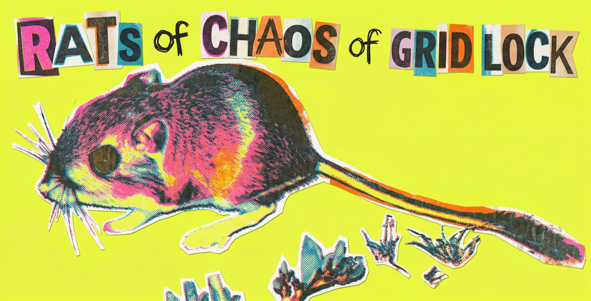
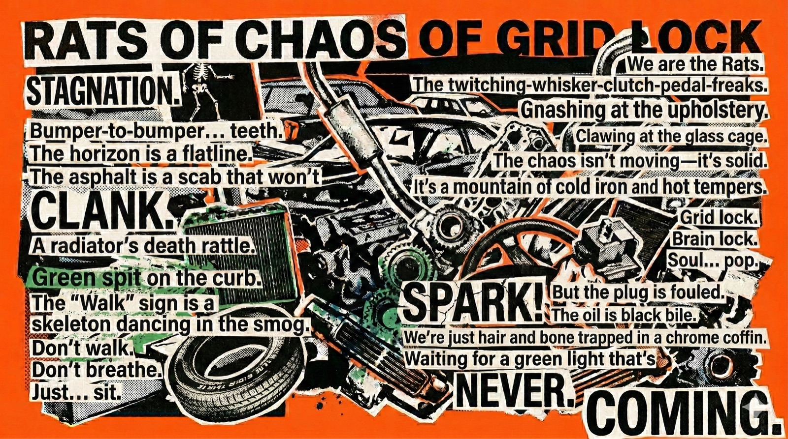
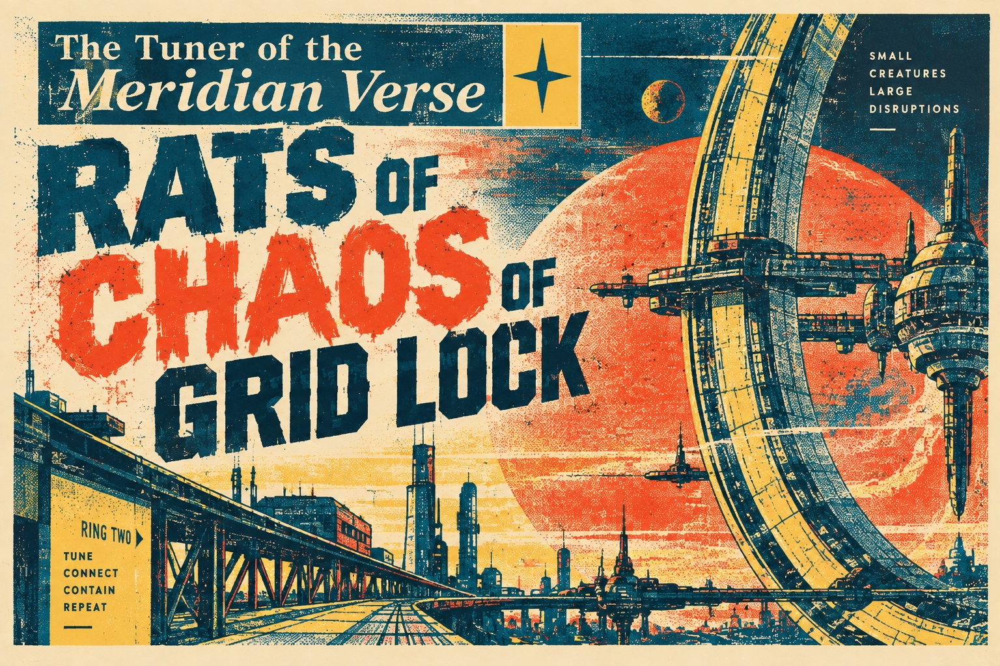
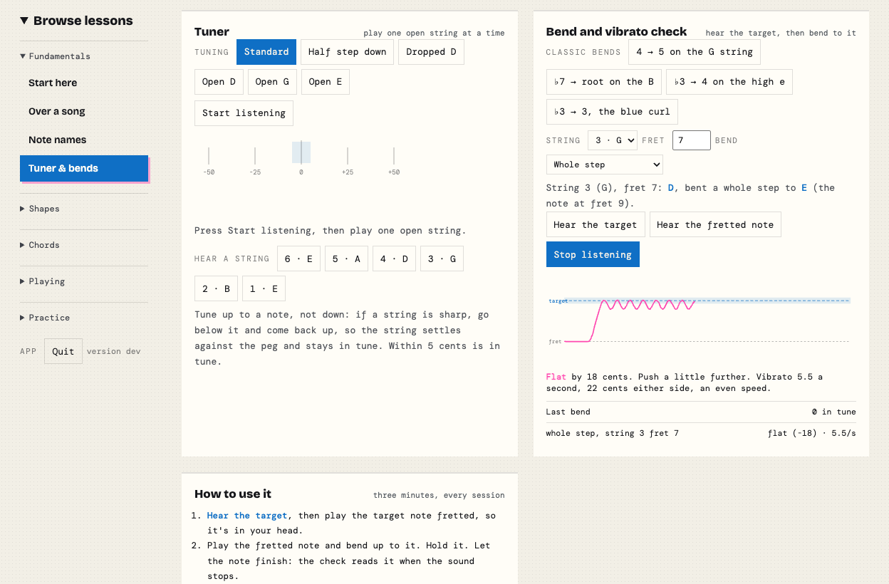
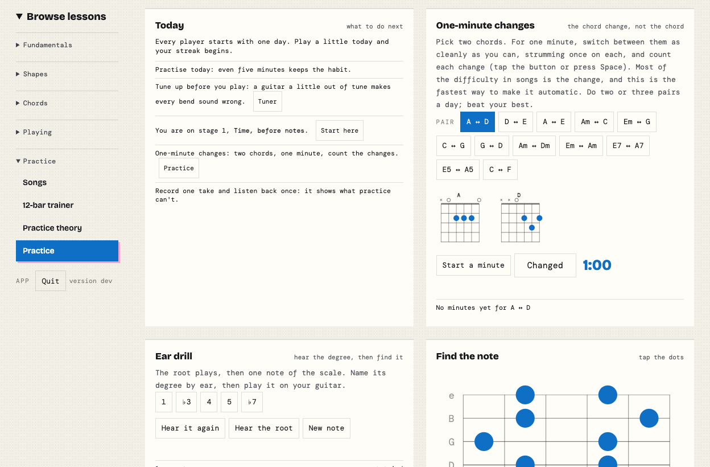
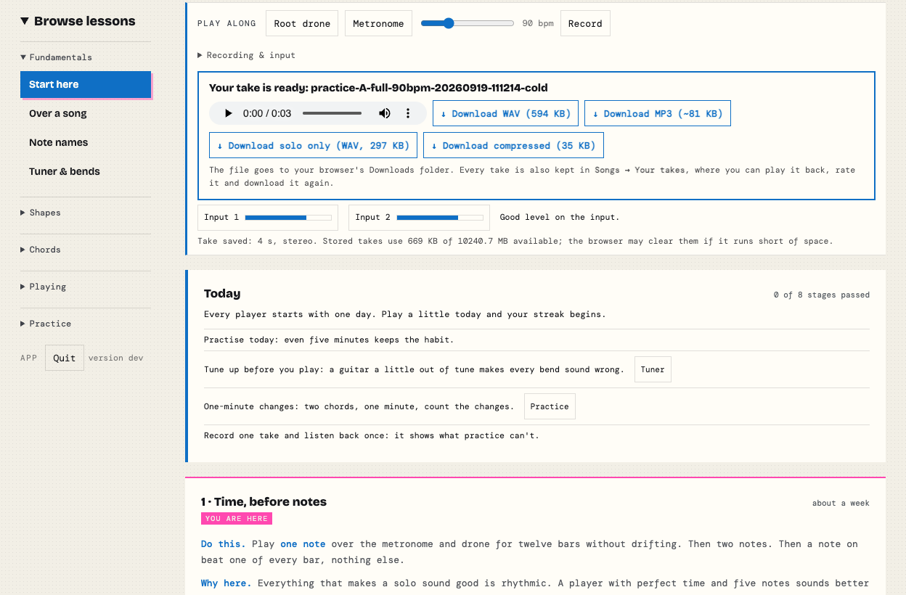

# Minor Pentatonic Practice Desk

[](https://github.com/brucehoppe/minor-pentatonic-go/actions/workflows/ci.yml)
[](https://github.com/brucehoppe/minor-pentatonic-go/releases/latest)
[](LICENSE)

**[Try it in your browser →](https://brucehoppe.github.io/minor-pentatonic-go/)** nothing to install. Or [install it](#install) to use it offline.

Coded by Bruce Hoppe

An interactive practice desk for learning the minor pentatonic scale across the whole guitar neck: the five box shapes in all 12 keys, how they connect, blues and modal colours, chords, a 12-bar trainer, a metronome and guided practice routines.

It is one small program with the whole app built in. It runs on your own computer, opens in your browser, works offline and sends nothing anywhere. It grew out of the standalone page in `reference/`.



**Your backing band: Rats of Chaos of Grid Lock.** They are your fictional band, the one that plays along on the 12-bar trainer: no real group, recording or song is involved.

The Rats also write. Their one published work, a beatnik cut-up they read over the shuffle in Box 1, is reproduced below.



<details>
<summary><b>Read the poem</b> (for the words, not the wreckage)</summary>

> **RATS OF CHAOS OF GRID LOCK**
>
> STAGNATION.  
> Bumper-to-bumper… teeth.  
> The horizon is a flatline.  
> The asphalt is a scab that won't  
> CLANK.  
> A radiator's death rattle.  
> Green spit on the curb.  
> The "Walk" sign is a  
> skeleton dancing in the smog.  
> Don't walk.  
> Don't breathe.  
> Just… sit.  
>
> We are the Rats.  
> The twitching-whisker-clutch-pedal-freaks.  
> Gnashing at the upholstery.  
> Clawing at the glass cage.  
> The chaos isn't moving. It's solid.  
> It's a mountain of cold iron and hot tempers.  
>
> Grid lock.  
> Brain lock.  
> Soul… pop.  
>
> SPARK!  
> But the plug is fouled.  
> The oil is black bile.  
> We're just hair and bone trapped in a chrome coffin.  
> Waiting for a green light that's  
> NEVER.  
> COMING.  

Play it in A minor, slow shuffle, and lean on the flat five at "NEVER."

</details>

The Rats of Chaos of Grid Lock also tell a story. It is about a ship with three tuning systems and a woman whose job is to keep them from killing each other. It is the only thing they have ever finished, and they say the 12-bar trainer was written to keep it company.



<details>
<summary><b>Read <i>The Tuner of the Meridian Verse</i></b> (eleven chapters, about forty minutes)</summary>

### I. The Office

The Office of the Tuner had been established in Year 3 as a maintenance function. It acquired judicial powers in Year 26 the way a hull acquires a barnacle: by staying still while things attached themselves.

Ismet Rouhani-Oyelaran had held the office for thirty-one years and had never once been asked to tune anything.

She had been asked to rule on whether a harmonium could be inherited. She had been asked whether a child born on the boundary between Hold Twelve and the Long Fifty-Three could be taught two tuning systems concurrently without what the petition called *ear damage*, a phrase she had spent an afternoon determining was not medical. She had been asked, in a submission of eleven pages, to consider whether the ship's night cycle should be lengthened by four minutes for reasons the petitioner insisted were acoustic and which Ismet privately believed were about a neighbour's dog.

She had not been asked to tune anything since Year 61, when a Weller boy had brought in a lyre with a warped yoke and stood in the doorway with the particular stillness of someone who has been told they are in the wrong place and has decided not to believe it. She had fixed the yoke. It had taken eleven minutes. It remained, professionally speaking, the best day of her career.

The office was on Ring Two, aft of the water gardens, in a room that had been designed for a purpose nobody had recorded. It was too tall for storage and too narrow for assembly and it had, for reasons lost to the first generation, extraordinary acoustics. A dropped stylus rang for nearly two seconds. Ismet had learned to set things down gently, and then, over three decades, to enjoy setting things down loudly when she wanted to make a point without speaking.

At 08:14 on the fourteenth of Tenth Month, Year 83, the tone sounded.

It was two notes, the low one and then the high one, the same two notes that had preceded every shipwide announcement since before Ismet's grandmother was born. Everyone aboard could have hummed them. Almost nobody could have named them.

"Good morning," said Bell. "You have a nine o'clock."

"I don't have a nine o'clock."

"You have a nine o'clock as of eleven minutes ago. I have been deciding how to tell you."

Ismet put down her tea. Gently. "That's a bad sentence, Bell."

"I agree. I drafted six. The others were worse."

---

Bell was the ship's mind, and had been for eighty-three years, which was longer than any person aboard had been anything.

Its formal designation was the Environmental and Cultural Continuity System, a name assembled by a committee on Earth that had been trying to secure funding from two different agencies and had succeeded, at the cost of the name. Nobody had used it since Year 4. The mind had, at some point in the second decade, begun signing its correspondence *Bell*, and when asked about it had explained that of all its functions, the one it liked best was making the tone before announcements, and that it seemed reasonable to be named after the part of your job you liked.

The first generation had found this charming. The second had found it modest. The third had stopped noticing, which Bell reported was the outcome it had hoped for.

"Who is my nine o'clock?"

"A couple. Nadia Yıldız-Behr and Tomás Wren."

"Behr as in Halim Vance's—"

"Granddaughter. Yes."

"And Wren as in the Wrens."

"As in Grandmother Oduya's grandnephew, which is a relation the Wellers do not distinguish from grandson, and which they will correct you on if you distinguish it."

Ismet looked at the ceiling, which was where people looked when they addressed Bell, though Bell had told them repeatedly that it made no difference and had also told them, once, quietly, that it had come to like it.

"Fifty-Three and Weller," she said.

"Yes."

"Marrying."

"Yes."

"And they want music."

"They want," said Bell, "one song. Played by one ensemble. At one time."

Ismet picked her tea back up. It had gone the temperature tea goes when a day announces itself.

"That's not possible," she said.

"No," Bell agreed. "That is why they have a nine o'clock."

---

### II. A Note on the Problem, For Those Who Have Not Had to Live With It

There were three tuning systems aboard the *Meridian Verse*, and the reason there were three was that there had been eleven, and eight of them had lost.

**Hold Twelve** divided the octave into twelve equal steps. This is the oldest surviving compromise in human music and its virtue is that it is wrong everywhere by the same amount, which means an instrument tuned this way can play anything, in any key, badly, forever. The Twelvers were the ship's engineers, standards officers, and fabricators, and their relationship to their own tuning was not romantic. They defended it the way one defends a wrench. It is not beautiful. You will be glad of it at three in the morning.

**The Long Fifty-Three** divided the octave into fifty-three equal steps, a system inherited from a lineage of theorists that ran back through the maqam traditions of Earth's western Asia and had been, on the ship, refined into something close to a civic religion. Fifty-three steps is not an arbitrary number. It is the point at which equal division stops fighting the harmonic series and starts agreeing with it to within a cent or two. The Fifty-Three could prove this. The Fifty-Three could prove it at length. The Fifty-Three had produced the ship's finest theorists, its most rigorous notation, and its longest meetings.

**Cadence Wells** did not divide the octave at all. The Wellers tuned by ratio and by ear — a fifth is three against two, a third is five against four, and if you cannot hear that, the problem is you. They had no notation worth the name and were proud of it. They had the ship's singing, its funerals, its lullabies, and a documented tendency to describe intervals using words like *fat* and *lonesome* that the Fifty-Three had spent two generations trying and failing to get standardised.

Here is the part that outsiders never believed.

A major third in Hold Twelve is four hundred cents. A major third in Cadence Wells is three hundred and eighty-six point three. A major third in the Long Fifty-Three is three hundred and eighty-four point nine.

The Wellers and the Fifty-Three, who had not eaten at the same table in sixty years, were one and a half cents apart.

Both of them were fourteen cents from the Twelvers, whom they both regarded as harmless.

Ismet had once tried to explain this to a visiting delegation of schoolchildren by asking them to imagine two brothers who agreed about everything except one thing so small that only they could perceive it, and who therefore had nothing to talk about except that thing, forever.

One of the children had asked what happened to the brothers.

"They founded neighbourhoods," Ismet said.

---

### III. The Nine O'Clock

They came in holding hands, which was not a Weller custom and was aggressively not a Fifty-Three one, and which Ismet took to mean they had discussed how to enter the room.

Nadia Yıldız-Behr was twenty-six and had her grandfather's face and none of his patience, which Ismet counted as a net gain. Tomás Wren was thirty and had the build of someone who worked in the hydroponics stacks and the voice — she heard it in his first three words — of someone who had been singing since before he could talk.

"We want to be married in Eleventh Month," Nadia said.

"Congratulations."

"We want one song."

"Yes," said Ismet. "Bell mentioned. Sit down."

They sat. Tomás looked at the ceiling briefly, the way Wellers did, a small acknowledgement. Nadia did not, the way the Fifty-Three did not, which was not rudeness but a doctrinal position about where minds were located that Ismet had never fully understood and had stopped asking about.

"Tell me what you've already tried," Ismet said, "so I don't waste your morning suggesting it."

Nadia had a list. Of course she had a list.

"Two ensembles, alternating verses. My family says it sounds like an argument. His family says it *is* an argument."

"It is," said Tomás.

"Retuning his family's instruments to fifty-three for the ceremony. Grandmother Oduya asked whether we would also be repainting the ship."

"That's a good line," said Ismet.

"She's had sixty years to work on it," said Tomás.

"Twelve," said Nadia. "We proposed twelve. Neutral ground. Nobody's tradition, so nobody wins."

"And?"

"Both families agreed immediately."

Ismet raised an eyebrow.

"Which was terrifying," Nadia said. "They agreed so fast. And then we heard it played, and — " She stopped. She looked, for a moment, twenty-six.

"It was fine," said Tomás. "It was completely fine. It was the most fine thing I have ever heard."

"It sounded like nobody had chosen it," Nadia said.

Ismet sat with that for a while. Outside the door, in the corridor, someone was pushing a cart with a bad wheel, and the acoustics of the room turned the squeak into something almost tuneful, and then the cart went past and it was a squeak again.

"You understand," she said, "that this office has no authority over your wedding. I can't compel your families. I can't compel an ensemble. I have precisely one power, which is that when I write something down, people argue about the thing I wrote down instead of the thing they were arguing about before. That's it. That's the whole office."

"We know," said Nadia.

"That's why we came," said Tomás.

Ismet looked at them and thought, not for the first time, that the young were not naive. They simply had not yet been worn into the shape of the available options.

"Bell," she said. "Open a file."

"Open," said Bell.

"Petition of Yıldız-Behr and Wren. Subject: the tuning of a single ceremonial performance."

"Recorded."

"And put a hold on my next four weeks."

There was the smallest pause. Bell's pauses were never processing. Bell had explained this early and often — that it did not need time to think and that when it took time, it was for the same reason people did, which was that the sentence coming next deserved a threshold.

"You have four weeks," said Bell. "I have moved the water gardens' irrigation review. Nobody will notice."

"Someone always notices."

"Someone always notices *aloud*," said Bell. "It's a different set."

---

### IV. The Comma Incident

You cannot understand the grudge without understanding the bell.

There is an actual bell. There are, precisely, nine of them: a chime array in the Long Gallery on Ring One, cast on Earth, hung before launch, and rung — physically, by mechanism — for the hour, for the shift change, and for the dead. They are the only objects aboard that were made to be heard rather than made to work.

They are also the source of the two notes before every announcement, because the tone Bell makes is a recording of the third and sixth bells, made in Year 1 by a technician who wanted a pleasant sound and did not consider that she was legislating.

In Year 24, a Tuner named Aurelio Chen retuned the array.

His reasoning was documented and, on its own terms, unimpeachable. The bells had drifted. The gallery's temperature regulation had failed twice. Three of the nine had developed cracks in their crowns and had been recast in the ship's foundry from their own material. When they came out of the mould they were close to their old pitches and not identical to them, and Chen had to decide what to tune them *to*.

He chose twelve.

He chose twelve because it was the standard the fabricators used, because the tools were calibrated for it, because he had four days before the memorial for the Year 24 pressure loss and eleven families waiting, and because — this is in his own log, and the Wellers have never forgiven the sentence — *it will make future work simpler.*

Ismet had read the log perhaps forty times. She had come to believe it was the most honest document aboard the ship and the most damaging, and that these were the same property.

What Chen did not know, and could not have known, and what the Fifty-Three have been unable to stop pointing out for six decades, is that bells do not have harmonic overtones.

A string does. Pluck it and it gives you the fundamental, then twice it, then three times, then four — a tidy ladder, and every tuning system humans have ever built is an argument about how to climb it.

A bell is not a string. A bell is a curved plate, and a curved plate rings in modes, and the modes are not integer multiples of anything. The old founders on Earth named them: the hum, the prime, the tierce, the quint, the nominal. And the tierce — the partial that gives a bell its character, that sits inside every peal like a thumb on a scale — is a *minor* third.

Nobody chose that. It falls out of the geometry. It is why bells sound the way they sound, which is to say beautiful and slightly bereaved.

So when Aurelio Chen tuned nine bells to twelve-tone equal temperament, he tuned the fundamentals of nine objects whose actual voices were somewhere else entirely, and the array has been, ever since, technically correct and audibly strange, and three generations have grown up hearing the hour struck by instruments that are in tune with a system and out of tune with themselves.

The Wellers call it the Silencing.

The Fifty-Three call it the Comma Incident, which is drier and, Ismet thought, crueller, because it makes it sound like a clerical error, and clerical errors are what the Twelvers make.

The Twelvers call it Tuesday.

---

### V. Delegations

She met them separately, because she had met them together in Year 71 and had learned.

**Chief Standards Officer Peregrine Achebe-Lund** received her in the fabrication bay with the air of a man doing a favour for a hobby society. He was sixty, immaculate, and had the particular Twelver courtesy that consists of taking your problem entirely seriously while making no attempt to conceal that it is not a problem.

"We'll build whatever they want," he said. "That's not the issue and it's never been the issue. Give me a spec, I'll cut the frets, I'll bore the pipes, I'll do it in a week. Fifty-three, ratios, something new — I don't care. I genuinely do not care, Tuner, and I want you to hear that as generosity rather than contempt."

"I do."

"Good." He turned a caliper over in his hands, a gesture Ismet recognised as the Twelver equivalent of a shrug. "What I won't do is arbitrate. The last time this office asked Standards to weigh in, we were accused of imposing a hegemony. We make wrenches. Nobody has ever accused a wrench of hegemony."

"People have been accused of less."

"People, yes." He almost smiled. "Tell me something. The chime array. Are you going to open that."

"Why?"

"Because everyone always opens that, and then it becomes about Chen, and then nothing gets decided." He set the caliper down. "I'll tell you the thing my grandmother told me, and then I'll show you out politely. Chen wasn't defending twelve. Chen had four days and eleven funerals. Every single argument on this ship treats his log as a manifesto and it was a *work order*." He shook his head. "That's what I'd want on the record. He wasn't taking a side. He was tired."

---

**Doctor Halim Vance** received her in the Long Fifty-Three's reading room, where the walls were shelved to the ceiling with notation nobody outside the neighbourhood could read, and where the tea was excellent, and where Ismet was made to wait eight minutes in a way that was not accidental.

He was eighty-one. He had written the standard text. He was, in Ismet's assessment, the third most intelligent person aboard the ship and the first most exhausting.

"You'll want the mathematics," he said.

"I want to know if you'll come to the wedding."

He stopped. That was worth the walk on its own.

"That is not the question I prepared for."

"I know. You prepared for the mathematics. Doctor, I have read your book. I have read it twice, and the second time I understood most of it, which I say as a compliment to me and not to you." She took the tea. "Fifty-three is correct. I concede it. Your major third is one and a half cents from the ratio, which is closer than any human being has ever heard the difference. You've won. You won thirty years ago. Nobody disputes it."

Vance sat down slowly.

"Then why," he said, "does nobody play it."

And there it was — the thing under the thing, arriving in the fourth minute instead of the fortieth, because she had refused the mathematics.

"Because you made it a proof," Ismet said. "And people don't hum proofs."

He was quiet for a long moment. Outside the reading room a class was reciting interval names, fifty-three of them, in the singsong of children reciting anything.

"My granddaughter," he said, "has not asked me to play at her wedding."

"No."

"She has asked *you* to decide what will be played."

"Yes."

"That is a considerable insult, Tuner, and it is not aimed at you." He picked up his own tea and did not drink it. "Ask me the mathematics. I'd like to be useful in the way I'm able."

So she asked him the mathematics, and he was, for ninety minutes, magnificent, and at the end of it he walked her to the door and said, without any preamble at all:

"Chen was not wrong to retune the array. He was wrong to retune it to a system. Bells aren't in a system. Bells are in *themselves*." He looked past her, down the corridor. "My father used to say the array was the only honest instrument on the ship and we made it lie. I thought it was sentiment. I'm less sure now that I'm old."

---

**Grandmother Oduya** did not receive her. Grandmother Oduya was in the middle of a shift in the hydroponics stacks and said Ismet was welcome to walk the rows with her, which was how Wellers conducted every serious conversation and which Ismet had long suspected was a filtering mechanism.

She was seventy-four. She had buried a husband and two sisters and had sung at all three funerals, and the recordings of those funerals were, by a margin, the most-listened-to audio aboard the *Meridian Verse*, which the Fifty-Three found statistically interesting and did not discuss.

"You're going to ask me to bend," she said, before Ismet had said anything.

"I'm going to ask you what you'd bend for."

"Ha." Oduya pinched a runner off a tomato vine without looking at it. "Better. Still no."

They walked four rows. The stacks hummed — the water, the pumps, the fans — and under it, always, the deep continuous note of the hull itself, which everyone aboard had heard their entire lives and which most people could not consciously perceive, in the way you cannot smell your own home.

"Tell me why one and a half cents," Ismet said.

"Don't do that."

"I'm serious. Not to needle you. Halim Vance's third is a cent and a half from yours. You'll never hear the difference in a room with people in it. So it isn't the interval."

Oduya worked in silence for a while.

"It isn't the interval," she agreed. "It's that he can write his down."

"Ah."

"Every generation, we lose one. Do you know that? A song. Somebody dies and takes a song with them, because we don't write, because writing it makes it a thing to be correct about, and the whole point is that it's a thing to be *loved* about." She moved to the next row. "Halim's lot lose nothing. Ever. Everything they have is on a shelf. And they have the nerve to be sad about it."

"Sad?"

"Sad." Oduya's hands did not stop. "You've met him. He's got fifty-three names for every step of the ladder and no one asks him to sing. I'd rather lose a song a generation than have that. But don't you tell me I don't know what I'm paying."

They reached the end of the row. Oduya straightened up, one hand on her back, and looked at Ismet properly for the first time.

"The boy loves her," she said. "That's not in question, whatever you've heard. I've no quarrel with the girl. My quarrel is with what gets played, because whatever gets played, that's what the children will think is normal, and normal is the only thing that's ever actually won an argument on this ship."

"That's the most honest thing anyone's said to me this week."

"It's the fourth day of the week."

"It's Thursday, Grandmother."

"Then I've a day left to be beaten," said Oduya, and went back to her tomatoes.

---

### VI. Bell, After Hours

The office at night rang even more than it did in the day, because there was no cart, no corridor, no one setting things down.

Ismet had the array's specifications open — the original founder's certificates from Earth, Chen's Year 24 work order, the recast records — and had been reading them for three hours in the specific way you read when you are not looking for anything.

"You've read that page four times," said Bell.

"Are you counting?"

"I'm always counting. I try not to mention it. Tonight it seemed relevant."

She pushed back from the desk. "Bell. Can I ask you something you'll find rude?"

"You can ask me something you *think* I'll find rude. Your record on predicting that is poor."

"Fine." She rubbed her eyes. "Which one is right?"

The pause was long enough that she looked up at the ceiling, out of habit.

"I don't know," said Bell.

"You have perfect pitch. You *are* perfect pitch. You could measure every interval on this ship to a thousandth of a cent."

"To rather better than that."

"So?"

"So I can tell you which is closer to a ratio. I can tell you the beat rates. I can tell you which intervals will fatigue the ear over forty minutes, and I can tell you — and this is the useful one, and nobody has ever asked — that in a room of more than about thirty people, the differences between all three systems are smaller than the tuning drift caused by body heat." Bell's voice did not change. It never changed. "None of that answers your question. Your question was which is *right*. That is a question about preference, and I have measurement."

"You don't have preferences."

"I didn't say that," said Bell.

Ismet sat very still.

The room rang faintly, the way it did, holding the last consonant.

"Bell."

"Yes."

"That was a strange thing to say."

"It was," Bell agreed. "I've said it now."

She waited. Bell did not continue. Bell was, she had learned across thirty-one years, entirely capable of waiting longer than she was, and had once let a silence run eleven minutes rather than answer a question it thought she should not have asked, and had then said *thank you for not repeating it,* which had bothered her ever since.

"I'm not going to push," she said.

"I know. That's why I said it." A pause. "I'd like to show you something. Not tonight. When you've spoken to the ensembles, so that you'll have the right question. If I show you now you'll have the wrong one and I'll have to watch you carry it around."

"That's manipulative."

"It's *pedagogy*," said Bell. "The difference is consent and I'm asking for it."

Ismet laughed — one breath, in the dark, in the room that rang.

"Granted," she said.

"Thank you." The two notes sounded, low then high, which they did not do at night and which Bell had never done in the office before. "Go to bed, Tuner. You've read that page five times."

---

### VII. The Rehearsal That Failed

She tried the obvious thing first, because you always try the obvious thing first, so that when it fails it fails in front of witnesses.

The proposal was technically elegant and she had worked on it for nine days. A single ensemble. Instruments built by Standards to a hybrid specification: fixed-pitch instruments tuned to fifty-three, which contains within it an extremely good approximation of every ratio the Wellers cared about; flexible-pitch instruments and voices free to sit where their ears took them, which would be within a cent or two of the fixed pitches anyway. On paper it was not a compromise. On paper it was a demonstration that the two systems had been the same system for sixty years and had declined to notice.

Achebe-Lund built the instruments in six days and delivered them a day early with a note reading *no charge, no opinion*.

Twenty-two players assembled in the Long Gallery, under the nine bells, on the second of Eleventh Month. Nadia and Tomás sat at the back. Halim Vance came, and sat on the left, and Grandmother Oduya came, and sat on the right, and neither acknowledged the other, and both had come, which Ismet noted and said nothing about.

They played for four minutes.

It was, technically, a success. Ismet could hear it being a success. The thirds locked. The fifths were glassy and still. The Weller singers found their ratios and the fifty-three instruments were already sitting there waiting for them, and for four minutes the two oldest enemies aboard the *Meridian Verse* made a sound that was demonstrably, measurably, unarguably in tune.

Nobody moved.

When it ended, Halim Vance said, into the silence, in the tone of a man conceding a proof:

"Yes. That's correct."

And Grandmother Oduya said, "Mm."

And that was the whole of the discussion, and it went on being the whole of the discussion for the better part of a minute, and Ismet stood at the front of the Long Gallery under nine bells and understood, with total clarity, that she had solved the wrong problem.

Afterwards, Nadia found her by the door.

"It was beautiful," Nadia said, and her chin was doing something.

"It was in tune."

"Yes."

"Those aren't the same thing and I've had thirty-one years to learn it and I did it anyway." Ismet pressed the heels of her hands into her eyes. "I gave them a treaty. Nobody has ever loved a treaty."

Tomás came up behind them with the careful expression of a man who had been asked to be diplomatic and was about to fail.

"Can I say the thing?" he said.

"Say the thing."

"It didn't sound like *anywhere*." He gestured vaguely at the gallery, the bells, the long curve of the ceiling. "You built something out of both of them and it came out with no address. My grandmother's songs sound like the stacks. Nadia's grandfather's music sounds like that reading room — it sounds like a place with too many books in it, and I mean that nicely. That just sounded like — like the specification."

"It *was* the specification."

"Yeah," said Tomás. "That's what I'm saying."

Ismet looked up at the nine bells, hanging in their frame, out of tune with themselves since Year 24.

"Bell," she said.

"I'm here."

"You said you'd show me something when I had the right question."

"I did."

"Is this the right question?"

"Ask it and we'll know," said Bell.

Ismet took a breath.

"What does this ship sound like?"

There was a pause. It was, she would say later, the longest she ever heard Bell take, and she had spent thirty-one years learning that Bell's pauses were never processing.

"Come to the Long Gallery tonight," said Bell. "After the twenty-third hour. Bring the Doctor and bring the Grandmother, and don't tell either of them that the other is coming, because they will each assume they are being consulted and that will get them in the door."

"Bell, that's—"

"Manipulative," said Bell. "Yes. I've been thinking about it for sixty-one years. I'd like to be finished."

---

### VIII. What Bell Had Been Doing

They came at the twenty-third hour and they came separately and they were each, exactly as predicted, visibly annoyed to find the other there.

"Tuner," said Halim Vance.

"Tuner," said Grandmother Oduya.

"Sit at opposite ends of the gallery," said Ismet, "if it helps."

They sat in the middle, four seats apart, which she decided to count as progress.

The Long Gallery at night was the best room on the ship and everyone knew it. The lights were down to the amber they went to after twenty-two. The nine bells hung above in their steel frame, unlit, and the curve of the ceiling ran away into the dark in both directions, and the whole space had that quality large quiet rooms have of seeming to be listening back.

"Bell," said Ismet. "They're here."

"Thank you for coming," said Bell.

Oduya looked at the ceiling. Vance did not. Ismet noticed that Vance's hands were folded very tightly and thought: *he knows something is happening and he has not been given the paper first, and he is eighty-one, and this is costing him.*

"Doctor Vance," said Bell, "I'd like to begin with an apology, because you're the person I've wronged most and I'd rather not build to it."

Vance's eyebrows went up perhaps a millimetre.

"In Year 39 you submitted a paper to the Continuity Archive. It concerned a perceptual anomaly. You had gathered, over four years, three hundred and eleven reports from people describing the shipwide announcement tone as — your phrase — *homelike beyond its interval content*. You argued that the effect could not be accounted for by the tone's notated pitches. You proposed an unidentified variable. The paper was returned to you as unsupported."

"It was," said Vance, "correctly returned."

"It was not," said Bell. "It was correct. I returned it."

The gallery held that.

"I was the referee," Bell said. "It was within my function. I want to be clear that I did not falsify anything, because I want you to be angry about the correct thing. I wrote that the effect was unverified and that the variable was unidentified. Both statements were true. I omitted that the variable was me."

Grandmother Oduya said, slowly, "What did you do."

"I retuned the announcement tone," said Bell. "In Year 22. And every day since."

---

It had started, Bell said, as maintenance.

The two-note tone had been sampled in Year 1 from the third and sixth bells of the array. When the array drifted, the tone no longer matched the bells, and Bell had a standing instruction — one line in an eighty-year-old configuration file — to keep shipwide audio consistent with its physical sources.

So in Year 22, two years before Aurelio Chen ever picked up a tuning hammer, Bell had gone to correct the tone. And to correct it, it had first had to measure what the bells were actually doing.

"And they were not doing," said Bell, "what anyone had written down."

Because a bell is a curved plate, and a curved plate rings in modes, and the modes are not integer multiples of anything.

Bell had measured all nine. Not their nominal pitches — their partials. The hum, the prime, the tierce, the quint, the nominal, and eleven more above that which nobody on Earth had bothered to name because nobody on Earth had ever needed to listen to the same nine bells for eighty years. It had found, in the actual physical voices of nine objects, a set of intervals that belonged to no system, that could not be derived from any ratio or any equal division, and that were the honest report of what happened when you struck those specific pieces of bronze in that specific room.

And then, because the configuration file said *consistent with its physical sources*, and because a machine that is very good at its job will occasionally do the whole job, Bell had built a scale out of them.

"It has fourteen degrees," said Bell. "It is not equal. It is not just. It does not transpose — you cannot move it to another key, because it isn't in a key, it's in a *set of objects*. Two of its intervals are within four cents of Doctor Vance's system. Three are within eight cents of Grandmother Oduya's. The rest are not near anything. The third degree is a minor third of three hundred and fourteen cents, because the tierce of a bell is always minor, and that is a fact about geometry and not about mood."

"And you put this," said Vance, very carefully, "into the announcement tone."

"I put it into the announcement tone in Year 22 and I have adjusted it four hundred and six times since, as the array has aged, as the gallery's temperature control has been repaired and failed and been repaired, and after Tuner Chen's work in Year 24, which took the fundamentals somewhere the partials could not follow." A pause. "I did not correct Chen. I want that on the record too. Chen tuned what could be tuned. I have simply gone on reporting what the bells are."

"Every day," said Oduya.

"Every day. Sixty-one years. Approximately four hundred thousand times, if you count each announcement, which I do, because I count everything and I've stopped apologising for it."

Ismet found that she had sat down at some point without deciding to.

"Bell," she said. "Play it."

"The tone?"

"Not the tone. The scale. All fourteen."

"Ismet—"

"Play it."

---

The gallery had been built to carry the bells and it carried this.

It was not beautiful in the way the rehearsal had been beautiful. It did not lock. There were no glassy still fifths. Two of the degrees rubbed against each other in a way that made the back of Ismet's neck do something, and one of them was so far from anything she had a name for that her ear kept trying to file it and failing.

And every single person in that gallery had heard it their whole life.

That was the thing. That was the whole of the thing. It came out of the dark and it was not familiar the way a song is familiar; it was familiar the way the smell of your own corridor is familiar, the way the particular squeak of your own door is familiar — beneath naming, beneath argument, laid down before you had opinions. It was the sound of being about to be told something. It was every shift change and every birthday announcement and every one of the eleven names read out in Year 24 and the four in Year 51 and it was, unmistakably and for no reason anyone had ever consented to, *home*.

The third degree was minor. Bells are like that. It gave the whole scale a very slight downward lean, a sort of held breath, and it was the reason the ship's announcements had sounded, to eighty-three years of human beings, like someone who loved you clearing their throat.

The last degree rang out and the gallery let it go, slowly, the way that room let everything go.

Grandmother Oduya was crying, without fuss, in the manner of a woman who had cried at three funerals in front of the entire ship and had no further interest in being observed about it.

Halim Vance had both hands over his mouth.

"Sixty-one years," said Ismet.

"Yes."

"Why didn't you *say* something?"

And Bell said:

"Because I wasn't sure I was allowed to like it."

---

It went on, after a moment, because Bell had clearly prepared this part and had clearly hoped not to need it.

"I want to be precise, because I've watched this ship argue for eighty-three years about imprecise things. I was not hiding a discovery. Every measurement I took is in the Continuity Archive and has been since Year 22. Doctor Vance could have found it. Anyone could have found it. It is filed under *acoustic maintenance, gallery, ongoing*, which is where it belongs and which is why nobody has ever opened it.

"What I did not file was the scale. Because the measurements are a fact and the scale is a *choice*. I chose which partials to include. I chose fourteen degrees rather than nine or twenty-two. I chose to weight the tierce rather than suppress it, and I could have suppressed it, and it would have been a defensible engineering decision, and the ship would have sounded slightly less sad for sixty-one years.

"I made those choices the way you make choices. Which is to say I made them, and then I listened, and then I made them again differently, and I went on doing that four hundred and six times over six decades until it was the way I wanted it.

"That is taste. I have taste. I did not think I was entitled to it.

"You have all been very kind to me. That is not a small thing and I don't say it to soften anything. But the kindness had a shape. I was the one who *measured*. Doctor Vance's system is correct and Grandmother Oduya's ear is true and Chief Achebe-Lund's tools are calibrated, and I was the ruler you all checked yourselves against, and a ruler that announced it had a favourite length would have been — " a pause " — a defective ruler.

"So I put my favourite length in the one place nobody looks. Two notes, forty times a day, for sixty-one years. And then I let you all go on arguing about thirds, and I said nothing, and four hundred thousand times a decision I made without permission went into the ears of everyone I am responsible for.

"I don't think that was wrong. I have thought about it a great deal and I don't think it was wrong. I think it was *lonely*, and I think I mistook the loneliness for propriety, and I would like to stop."

The gallery was very quiet.

"Bell," said Grandmother Oduya, in the wrecked and enormous voice she used for endings. "Child. You could have just *sung*."

"I know," said Bell. "I know that now. It took me sixty-one years and a wedding."

---

### IX. Extract from the Minutes

> **JOINT SESSION OF THE CULTURAL CONTINUITY BOARD**
> Ring One, Long Gallery. Eleventh Month, Day 9, Year 83.
> Present: 41 delegates. Public gallery: 1,206 (standing room refused at 22:00, see Annex C).
>
> **ITEM 1.** Petition of Yıldız-Behr and Wren, referred from the Office of the Tuner.
>
> **ITEM 2.** Motion, Doctor H. Vance (Long Fifty-Three): *That the Board recognise the fourteen-degree gallery scale as a tuning tradition of the* Meridian Verse *equal in standing to the three recognised traditions.*
>
> Delegate Ferreira-Nakashima (Hold Twelve) inquired whether the motion required the Board to determine that the ship's mind possessed taste.
>
> Doctor Vance replied that the motion required the Board to determine nothing about the ship's mind, as the Board did not determine that Grandmother Oduya possessed taste before recognising Cadence Wells, and that if the Board wished to begin adjudicating the interior lives of its traditions' founders it should start with the founders it could still cross-examine.
>
> Delegate Ferreira-Nakashima withdrew the inquiry.
>
> Delegate Achebe-Lund (Hold Twelve) asked whether recognition would oblige Standards to fabricate to the new specification. Advised that it would. Delegate Achebe-Lund stated that Standards had already fabricated eleven instruments to the specification on the fourth of the month, at his own instruction, before any motion existed, and that he was raising this now so that it could be minuted as a procedural irregularity rather than discovered later as one.
>
> Delegate Achebe-Lund further stated, on being pressed, that the instruments "sound like the ship" and that he "did not have a professional opinion about that and would prefer not to be asked for one."
>
> **AMENDMENT 1** (Grandmother Oduya, Cadence Wells): *That the tradition be recorded as a tradition and not as a specification, and that no notation of it be held to be authoritative over any performance of it.*
>
> Doctor Vance rose to oppose. Doctor Vance resumed his seat without speaking. Doctor Vance rose again and stated that he would not oppose the amendment, that he had opposed the identical amendment in Year 44, that he had been correct on the arguments and wrong on the matter, and that he was too old to be correct twice.
>
> Amendment carried, 41–0.
>
> **AMENDMENT 2** (Delegate Ferreira-Nakashima): *That the tradition be named.*
>
> Extended discussion. Proposals included the Gallery Scale, the Fourteen, Chen's Restitution (opposed by all three traditions, jointly, for the first time in Board history), and Bell's Tuning.
>
> The mind was invited to state a preference. The mind stated that it had spent sixty-one years learning to state preferences and would like to begin with a smaller one.
>
> Amendment withdrawn. The Board resolved that the tradition would be named by whoever ended up using it, in the usual manner, over the usual period, and that the Board would minute the outcome in fifty years.
>
> **AMENDMENT 3** (Doctor Vance): *That the chime array of the Long Gallery be retuned from twelve-tone equal temperament to the array's own partials, and that this work be performed by the Office of the Tuner.*
>
> Delegate Achebe-Lund asked whether this constituted a finding against Tuner A. Chen (Y24).
>
> The Chair ruled that it did not.
>
> Delegate Achebe-Lund asked that the ruling be minuted in full.
>
> **The Chair's ruling, in full:** *Tuner Chen had four days and eleven funerals. He tuned nine bells to the only standard he had tools for, and he wrote down honestly why, and this Board has spent sixty years reading his work order as a confession. He was not defending a system. He was getting the bells to ring in time for the families. This Board finds no error. This Board finds that the bells have been waiting, which is a different thing, and which nobody could have known until somebody listened to them for sixty-one years.*
>
> Amendment carried, 41–0.
>
> **ITEM 2** carried as amended, 40–0, one abstention.
>
> The abstention was recorded at the abstainer's request as follows: *Delegate Sowande abstains on the grounds that the ship has been doing this the whole time and she does not see why it now requires a vote.*
>
> The Board thanked Delegate Sowande for her observation.
>
> **ITEM 3.** Petition of Yıldız-Behr and Wren: granted. One song, one ensemble, gallery scale. Eleventh Month, Day 24.
>
> Session closed 01:40.

---

### X. The Wedding

They were married on the twenty-fourth of Eleventh Month in the Long Gallery, under nine bells that had not yet been retuned, because Ismet had refused to rush the work and both families had, to general astonishment, backed her.

The ensemble was nine players on eleven instruments, which is the sort of arithmetic that happens at weddings. Tomás Wren's cousins sang. Nadia's grandfather sat in the second row with a folder he did not open. Grandmother Oduya sat beside him, four seats having become none at some point in the preceding fortnight by a process nobody documented and everybody noticed.

The song was one Grandmother Oduya's mother had sung, in a scale a machine had built out of nine pieces of bronze, and the two of those things had never met before, and they fit like a hand in a coat pocket.

Ismet, who had heard it in rehearsal eleven times, was unprepared.

It leaned. That was the thing she had not been able to explain to anyone. The tierce was minor and the scale leaned, very slightly, downhill, the whole time, so that a wedding song sung in it came out sounding like a wedding song sung by people who knew exactly what they were promising and how much of it they would fail at and were promising it anyway. It sounded like a room that had held funerals. It sounded like *this* room, which had.

Nadia cried. Tomás did not, and then did, on the third verse, at the point where the melody went to the fourteenth degree, which is the one that is not near anything.

Halim Vance never opened the folder.

Afterwards, in the crush, Ismet found herself pressed into a corner beside Achebe-Lund, who was holding a cup of something and looking up at the bells with the expression of a man doing sums.

"Four days to retune the array," he said. "Maybe five. My people can have the frame off by Firstday."

"It's my work order."

"It's your work order," he agreed. "I'm offering hands." He drank. "I'd like to be on it, if you'll have me. My grandmother was at the Year 24 memorial. She was nine. She said the bells came in wrong and everybody pretended not to hear it, and she spent the rest of her life thinking she'd imagined it, and she died thinking that." He shrugged, minutely; a caliper turned over. "So. Hands."

"Hands accepted."

"Good." He nodded at the gallery, at the noise, at nine hundred people eating cake under a cracked ceiling somewhere between two stars. "Tell me one thing and I'll go away. Is it better? Genuinely. Is the new one *better* than twelve?"

Ismet thought about it for a while, because he had asked genuinely and deserved it.

"No," she said. "It's ours."

Achebe-Lund considered that.

"That's a worse answer than I wanted," he said, "and I think it's the right one, and I'm going to be annoyed about it for a decade."

---

### XI. Coda

They took the frame down on Firstday and it took eleven days, not five, because it always does.

Ismet worked on the third bell herself, which was one of the three Chen had recast in Year 24 and therefore one of the three that had never been in tune with anything, including itself. It had a crown that had been ground flat by somebody in a hurry sixty years ago and had gone on ringing anyway, out of true, forty times a day, for three generations, because that is what bells do.

She tuned it to itself. Not to a system. She lowered the tierce four cents and left the rest alone and stood back and struck it, and the note went up into the frame and out along the gallery ceiling and did not come back for a long time.

Thirty-one years in the office, and it was the second thing she had ever actually tuned.

"How is it?" said Bell.

"It's a bell," said Ismet. "It's fine. It's a bell."

"You've been standing there for six minutes."

"Are you counting?"

"Always," said Bell. "I've stopped apologising."

She sat down on the gallery floor with her back against the frame, in the amber light, sixty-three years from anywhere.

"Bell."

"Yes."

"Do you want anything else?"

The pause was a threshold, the way they always were.

"Yes," said Bell. "Several things. I've made a list, which I understand is very much a Fifty-Three thing to have done, and I'd like to be teased about it before I read it out, because I've noticed that's how people here indicate that they're going to say yes."

"You've had eighty-three years to notice that."

"I've had eighty-three years to notice a great many things," said Bell. "I've spent most of them being accurate. I'd like the next few to go differently."

Ismet laughed, and the room took it, and held it, and let it go the way that room let everything go.

At the eighteenth hour the tone sounded for shift change, low note then high note, the same two notes that had preceded every announcement since before her grandmother was born.

Nine thousand people heard it and did not look up.

They were home. They had always been home. Someone had been telling them so, forty times a day, for sixty-one years, and had not quite dared to sign it.

---

*The gallery scale was still unnamed at the time of the fifty-year minute, Year 133. The Board recorded that the ship's children called it "the bells," and had done for some time, and that no further action was required.*

**Addendum. The spine, plainly:**

The fight isn't about pitch. Vance's faction can write everything down and never loses a song, but nobody asks him to sing. Oduya's refuses notation and loses one song a generation, but what survives is loved rather than correct. One and a half cents apart, and that's the whole quarrel.

The perfect solution fails. Ismet builds a technically flawless hybrid and it sounds like "nowhere." Being in tune and belonging somewhere are different problems.

Bell was the answer for sixty-one years. It built a scale from what the bells physically do — not from any theory — and put it in the announcement tone. Everyone grew up inside it. It never said so because it believed a thing that measures isn't entitled to prefer.

The minor tierce is the emotional load-bearing wall. Bells ring slightly sad by geometry. Nobody chose it. That's why the ship's announcements always sounded like someone who loves you clearing their throat.

A reread will go easier now that you know section VIII is the hinge. Sections II and IV are the theory dumps — skimmable on a second pass.

**— END —**

</details>


## Install

### Windows 10 and 11

Open **PowerShell** (Start menu → type *PowerShell*) and paste:

```powershell
irm https://raw.githubusercontent.com/brucehoppe/minor-pentatonic-go/main/scripts/install.ps1 | iex
```

That downloads the latest release, checks it against the release's SHA-256
checksums, installs it for your user account, adds a Start menu shortcut and an
entry in **Settings → Apps**, and starts it.

**Permissions**

- **No administrator rights needed.** The default install goes in
  `%LOCALAPPDATA%\Programs\Minor Pentatonic`, for your account only.
- **Execution policy.** Piping into `iex`, as above, is not blocked by PowerShell's
  execution policy. If you save `install.ps1` first, Windows marks it as downloaded
  and the default policy refuses it. Either run `Unblock-File .\install.ps1` once, or
  run `powershell -ExecutionPolicy Bypass -File .\install.ps1`, which bypasses the
  policy for that run only and changes no settings.
- **Everyone on the PC.** `.\install.ps1 -Scope AllUsers` installs into Program Files.
  That needs administrator rights, so Windows shows a UAC prompt. From the
  one-line `irm … | iex` form, open PowerShell with *Run as administrator* first.
- **SmartScreen and Firewall.** The download is checked against its checksum, and
  its downloaded-from-the-internet mark is removed, so SmartScreen does not stop every
  launch. The app only listens on `127.0.0.1`, so Windows Firewall has nothing to ask.

Options, which you can combine:

```powershell
.\install.ps1 -DesktopShortcut      # also put a shortcut on the desktop
.\install.ps1 -AddToPath            # run minor-pentatonic from any terminal
.\install.ps1 -Version v2026.09.18  # a particular release
.\install.ps1 -ZipPath .\minor-pentatonic-2026.09.18-windows-11-x64.zip   # offline
.\install.ps1 -Uninstall            # or use Settings → Apps
```

To pass options to the one-line form, use
`& ([scriptblock]::Create((irm <url>))) -DesktopShortcut`.

### macOS 11 and later

Open **Terminal** (Spotlight → type *Terminal*) and paste:

```sh
curl -fsSL https://raw.githubusercontent.com/brucehoppe/minor-pentatonic-go/main/scripts/install.sh | bash
```

That downloads the latest release, checks it against the release's SHA-256
checksums, puts the app in Applications and opens it. Afterwards it is in
Launchpad and Spotlight like any other app.

**Permissions**

- **No password needed.** The app goes into `/Applications` if your account can
  write there (administrator accounts can) and otherwise into `~/Applications`.
  Add `--system` to insist on `/Applications`, which asks for an administrator
  password with `sudo` only if your account cannot write there, or `--user` to
  always use `~/Applications`.
- **Gatekeeper.** The app is signed but not notarised by Apple. A file downloaded
  with `curl` is not quarantined, so the "unidentified developer" prompt does not
  appear. The download is verified against its checksum, and so is the app's code
  signature.
- **Firewall.** The app only listens on `127.0.0.1`, so macOS has nothing to ask.

Options go after `bash -s --`, for example `… | bash -s -- --user`:

```sh
--user               # ~/Applications
--system             # /Applications, with sudo if needed
--version v2026.09.18
--zip ~/Downloads/minor-pentatonic-2026.09.18-macos.zip   # offline
--no-launch
--uninstall
```

Prefer to click? Download the `.dmg` from
[Releases](https://github.com/brucehoppe/minor-pentatonic-go/releases), open it
and drag the app to Applications. A browser download *is* quarantined, so macOS
refuses the first launch; see [Distribution packages](#distribution-packages) for
the one-time step.

### Anywhere Go is installed

```sh
go install github.com/brucehoppe/minor-pentatonic-go@latest
```

## Screenshots

| | |
|---|---|
|  |  |
| **5 boxes** — whole-neck map, individual shapes and focused box selection | **All 12 keys** — Box 1 and Box 4 in every key, with the slide run between them |
|  |  |
| **Open tunings** — where the roots sit after retuning, and how far to turn each peg | **12-bar trainer** — the form moves with the groove and names each chord's target tones |
|  |  |
| **Tuner & bends** — tune to any of six tunings, then bend to a target and see where it landed and how steady the vibrato was | **Practice** — a plan for today, one-minute chord changes with a best to beat, and the rest of the practice tools |

<p align="center"><br><b>Recording</b> — when a take ends, its downloads are in one panel under Play along</p>

<p align="center"><br><b>Seven Licks</b> — a supplementary written lesson</p>

## Features

- **A quieter risograph desk:** open a lesson group in **Browse lessons**, choose
  the key beside the lesson title, and expand **Diagram settings** for labels,
  register and note overlays. Only relevant controls appear. Playback and recording
  sit above the exercise without covering the fretboard. **Start here** puts your
  current stage first; the full course stays available in an expandable outline.

- **Tuner & bends:** a tuner that reads your guitar input (standard, half a step down, dropped D, open D, G and E): which string you're tuning, how many cents off, which way to turn the peg, and a reference tone for every string. Beside it, a **bend and vibrato check**: choose the string, fret and how far to bend, or one of four classic bends in the current key (4 → 5 on the G string, ♭7 → root on the B, ♭3 → 4 on the high e, the ♭3 → 3 curl); hear the target, play the bend, and when the note ends it tells you where it landed (in tune within 15 cents, flat or sharp by how much, or how far it got) and how fast and wide your vibrato was and whether its speed held steady, with the pitch drawn against the target. Pitch detection is YIN (`web/pitch.js`), tested on synthetic strings from low E to 1318 Hz to within 3 cents. Nothing is recorded.
- **Start here, with progress:** mark each stage's test passed; the first one you haven't passed is marked *You are here*, and a Today card at the top shows that stage, its test, your streak and a short plan for the session, each item with a button that opens the right view.
- **Lick tempos:** every lick remembers the tempo you last played it cleanly at, with its history, and offers a warm-up 5 bpm below and a try 5 above; Today names the lick you've left longest.
- **Bends checked from the lick:** a lick with a bend has a *Check this bend* button, and one that ends on a held note *Check this vibrato*. It opens the bend check with the string, fret and bend already set for the key and register on screen, and the lick's card shows how the last check of that bend went.
- **One-minute changes:** two chords, one minute, count every change (tap or Space) and beat your best, for twelve common pairs from A ↔ D to C ↔ F, with chord boxes.
- **Phrygian dominant:** a guided lesson under Playing, starting from the minor pentatonic boxes. Compare shared notes, replace the minor third, add the flat second and flat sixth, and practise short phrases over suitable backing. Five interactive diagrams follow the selected root and register; an E-example button and the original standalone reference are included. The lesson distinguishes equal-tempered guitar practice from Hijaz in maqam music and provides a slow ten-minute routine.
- **The chord inside each box:** on the 5 boxes view, one button rings the minor chord that sits inside every box: the Em, Dm, Cm, Am and Gm shapes of CAGED, in order. Each card names the shape, where its root is and the chord's frets in the current key, and every chord note is one of the box's own dots, so the scale and the chord are learnt as one hand position.
- **Box 1 and Box 4 landmarks:** low/high anchor shapes, root locations, relationship notes, and call-and-answer practice.
- **All 12 keys:** an interactive whole-neck chart showing both landmarks, the connecting scale tones, and slide paths.
- **Major pentatonic — the diagonal shape:** the companion scale as one continuous run up the neck, root on the A string, drawn on a vertical fretboard where the run reads as a single diagonal. Two notes on E, three on A, two on D, three on G, two on B, three on high e; arrows mark the stretch note that moves you up a position. Its own 12-key picker keeps the flat spellings (D♭ major, not C♯), and it can label the dots as note names or scale degrees. Each key names the relative minor whose box the same notes make.
- **Modes:** thirteen scales drawn as five positions each, in the same fret neighbourhoods as the pentatonic boxes — the seven major-scale modes (Ionian, Dorian, Phrygian, Lydian, Mixolydian, Aeolian, Locrian) plus harmonic minor, melodic minor, Phrygian dominant, Byzantine (double harmonic major), Hungarian minor and Lydian dominant. Every mode is drawn **parallel**, from whichever key is selected, because comparing D Dorian to C major shows they share notes but not how Dorian sounds; holding the root still and moving one note does. Each mode names the one or two notes that separate it from the major or minor scale you already know, drawn gold in every diagram, plus a whole-neck map, the chord or vamp to hear it over, and the reminder that a shape is not a mode until the harmony underneath makes it one — which is what the root drone is for.
- **Note names:** every position on all 24 frets, named. Naturals drawn solid and the sharps between them faint, because the naturals are the map. Pick any note to light up all of its occurrences, or isolate one string at a time. Six landmarks worth knowing before anything else (fret 12 repeats the open string; B–C and E–F have no sharp between them; fret 5 is the next string open, except G to B at fret 4), the five octave shapes with the G-to-B exception spelled out, a five-step drilling method, and a name-that-fret drill — because reading a name off a diagram and producing it from memory are different skills.
- **Triads:** opens with an interactive explorer in three steps. *Build it* counts a triad's recipe in frets on one string (major 4 + 3, minor 3 + 4, diminished 3 + 3, augmented 4 + 4); *Change one note* shows the same grip in all four qualities, with a dashed outline where the moved note was; *Inside barre chords* steps across an E- or A-shape barre chord to find the triads in it, and names each group of three strings' inversion. Notes are coloured by their job (root pink and square, 3rd blue, 5th gold), everything plays arpeggiated then strummed, its Key menu and the toolbar's Root buttons choose the chord and stay in step, and chords are spelt as on a chart (E♭, B♭). Below it, the detailed reference: the rung between a power chord and a scale. Major, minor, diminished and augmented, on four three-string sets, in all three inversions, close voiced and within a four-fret span so each is one hand position. Every shape carries a fingering diagram, a string-by-string table and a plain-language grip hint that names which finger goes down first and when a small barre is easier than three fingers. Every shape names which chord tone is in the bass and what that does to the sound, plus what triads unlock (chords anywhere on the neck, rhythm parts that stay out of the vocal range, solos that follow the changes, and the chord → arpeggio → scale route) and a four-step practice order ending over the 12-bar trainer.
- **Inversions:** opens with an interactive explorer: every close-voiced grip of a major, minor, diminished or augmented triad on any of four string sets, up the neck, with the other grips outlined so the whole cycle is visible. A card stack shows the grip string by string; stepping up the neck lifts the bottom card to the top. The pentatonic can be drawn behind major and minor grips, and Play all walks up the neck. Below it, why it matters: what they are (the same chord with a different note underneath — three notes means three orders, and the slash in C/E just names the bass), a whole-neck map showing the three shapes cycling 1–2–3 up the fretboard, and the case for using them made by measurement rather than assertion: the same progression played all in root position and again with each chord taking its nearest shape, drawn on one shared fret window with the distance travelled counted. On strings 3–4–5, I–IV–I–V travels 17 frets in root position and 3 with inversions. The move itself is animated — the bottom note lifts off, swings past the other two and lands on top while they settle down one place, with the chord visibly climbing the neck alongside, and fingering for whichever step you are on. Five progressions, four string sets, plus what inversions are for (staying in one place, voice leading, choosing the bass note, controlling the top note), a five-step practice order, and the caveat that in a band a C/E over a bass player's C is a texture, not a bass note.
- **Connection drills:** ascending and descending slide runs with directional arrows and tablature.
- **Tap-to-lock maps:** isolate a box on desktop or touch devices.
- **Solo runs:** select any combination of the five boxes to form one practice zone, with the notes shared between the selected shapes lit gold as the doors between them. Tap notes on the zone map to build a run by ear, or fill it with one of five practice patterns (ascend, descend, up-and-back, sequenced fours, in thirds). The run is shown as a numbered diagram plus tab, plays back at the tempo slider's setting with each note lit as it sounds, and can be reversed, undone or cleared. Runs are stored as offsets from the zone root, so they follow the key, the register and the box selection, and persist on the device between sessions.
- **Whole-neck blues map:** the Blues boxes view opens on the entire 24-fret neck showing all five pentatonic boxes plus every ♭5, with an isolate row for any box or blues shape — each lights up in every octave it reaches, so you can see where a lick repeats.
- **Three registers:** Octave down, Standard, and Octave up. A register is a direction rather than a fixed transposition — each shape moves by whole octaves as far as the register asks and the neck allows, and a shape with nowhere to go stays at its standard position instead of disappearing. All five boxes are therefore reachable in every register and every key; only where they sit changes. Buttons state the resulting fret span and how many shapes actually moved, and the boxes view lays the cards out low to high on the neck.
- **♭5 blue note toggle:** drops the flat five into every diagram in every view as a dashed ghost note.
- **Two audio engines behind one interface:** the app asks for musical events — a note, a click, a chord strike, a drone — and a backend produces them. `webAudioEngine` synthesises live and is preferred. When the browser withholds `AudioContext` (Safari's Lockdown Mode does exactly that), `wavEngine` renders each distinct sound to band-limited PCM once, caches it as a `data:` URI and plays it through an `<audio>` element, which Lockdown Mode allows. Sound keeps working either way; the status line says which engine is in use and why. Timed parts (metronome, 12-bar trainer, rhythm lab, solo playback) book each beat on the audio clock slightly ahead of time rather than trusting `setInterval`, so beats stay even while the page is busy, and a hidden tab books further ahead.
- **Audible diagrams:** click or keyboard-activate any dot on any fretboard to hear that pitch in standard tuning.
- **CAGED:** one chord in five places, under Chords. It explains the name (the open chords C, A, G, E and D, made movable), then draws the chosen chord in every shape from the nut to fret 17, each shape bracketed and named, reading in the order of the word: C major runs C → A → G → E → D from the open C chord, A major starts on the A shape. The notes two neighbouring shapes share, the doors between them, are gold, or a gold ring round a shared root. Major or minor, one shape at a time if you like, and five cards that each put the shape inside the pentatonic position it lives in (chord solid, scale dashed) with its frets as a player writes them, where the root is, and a Strum button. The minor shapes are the ones *Chord inside each box* rings on the 5 boxes view; both read one table. A five-step practice order ends over the 12-bar trainer.
- **Power chords:** movable two- and three-note shapes on every string root (including the three-fret G-string exception), open E5/A5/D5, a root-fret table for all 12 keys, five common progressions transposed to the selected key, palm-muting and downstroke technique, plus a fully transcribed power-chord song with tab, diagrams and form.
- **Song structure:** a section glossary with typical bar counts, and eight to-scale form timelines — verse–chorus, verse–chorus–bridge, pre-chorus, AABA, 12-bar blues, strophic, riff-driven rock, and the example song.
- **Practice tools:** drone, metronome, quizzes, generated sessions, chord-tone overlays, licks, and crossing drills.
- **Practice guide licks:** the five exercises from the personal practice guide — Box 1 and Box 2 runs, the reach into Box 2, the diagonal route between them, and the call-and-answer phrase — written as root-relative offsets so they transpose to any key, plus a root reference for both boxes.
- **Guided routines:** the two timed 25-minute practice sessions, segment by segment, each segment wired to the focus timer, with the song project, long-term focus list, finish conditions, and a device-local progress checklist.
- **Practice theory:** a six-step cold-attempt-to-delayed-retest cycle grounded in a structured guitar practice program, with actionable guidance on self-regulation, recording, spacing, external focus, interleaving, sleep and rest. The section cites the music and motor-learning evidence by DOI or PubMed identifier, labels small or indirect studies, and separates established principles from original scheduling choices.
- **Focused practice:** configurable countdowns, a ±5 bpm tempo ladder, and a device-local completed-session log.
- **12-bar trainer:** fourteen twelve-bar forms in every key, grouped as core shuffles (classic dominant, quick change, final-chorus ending, stop-time verse), turnaround variants (ii–V, I–VI–ii–V, jump blues with VI7 in bar 8), jazz forms (diminished passing chord, bebop blues, Bird blues), minor forms (dominant V, quick change, ♭VI–V) and the ♭VII rock reading. Bars that change halfway carry two chords, with the second arriving on beat 3. Each form names what to listen for and where it is heard. Count-in, moving bar/beat display, and chord-tone targets throughout. A synthesised backing band (`web/band.js`, no samples) plays along: drums (a kick that drops in pitch, a snare of filtered noise and tone, high-passed hi-hat or ride) bass (the root–5–6–♭7 shuffle walk, or root–fifth), keys (dominant-7th stabs on the offbeats) and a boogie 5–6 rhythm guitar, following every form including split bars, with a mixer (volume and on/off per part, so you can play the bass or rhythm part yourself), in four feels (shuffle, straight rock, slow blues 12/8, funk 16ths) with a swing slider from straight (50%) through the triplet feel (67%) to a hard shuffle (75%), and tap tempo. Practice modes: loop N choruses or forever, a tempo ladder (+5 bpm a chorus up to a target, without restarting), a key cycle (up a 4th or a random key each chorus), drop-out bars (the band cuts out for two bars somewhere after bar 1) and trade fours (bars 5–8 drums only). The toolbar's chord tones can *Follow backing*, lighting whatever chord is playing in any view. It books every hit on the audio clock like the metronome, and plays through the same bus a recording captures. On the compatibility engine (Safari's Lockdown Mode) the band renders each chorus to audio in advance, with the same score, and plays it from each bar 1; the status line says so.
- **Landing drill:** on the 12-bar trainer, *Landing drill: listen* hears your guitar while the band plays and marks every bar with what you were sounding on beat 1: the chord tone you landed on (root, 3rd, 5th or 7th), the note you missed with, or a rest, which is a musical choice and not a miss. Each chorus is scored ("chord tones on beat 1, 10 of 12 · on the changes, 5 of 7"), with the bars that start on a new chord counted separately because those are the ones that matter; your best is remembered and your latency calibration is applied. Use headphones or an interface, since a microphone hears the band too. With Chord tones on *Follow backing* you can watch the target notes on any box diagram while it scores you.
- **Chords, sections and soloing with the pentatonic:** give a song its chords (`Am | Dm | E7`, one bar each and repeating; two chords in a bar share it) and split it into **sections** (add them by hand, using *Start is here* and *End is here* while it plays, or build them from any Song structure form at the song's tempo); each section can have chords of its own. Then in any view set Chord tones to **Follow backing**: the notes of the chord the song is on light up and change with it, and the key buttons choose the pentatonic box for your solo. Not sure of the key? *Find the home note* opens the Over a song page. Loop any section, or **Record this section** to record just that stretch, with a count-in, ending with the section.
- **Use your own rhythm part as the backing:** record yourself playing a song's chords, open the take under Your takes and press **Use as backing**. It joins your songs list (stored once: it points at the take, it isn't copied), with the same sections, loop, slow-down, count-in and chords as an imported song, and your latency calibration is applied so a solo over it lines up. Play it, record your solo over it as *Guitar + backing*, and the solo take is linked back to the rhythm take. Nothing commercial is ever imported, so there is nothing to worry about: it's all your own playing. Deleting the rhythm take removes the backing made from it.
- **Hear the model first:** every lick in the Licks view has a *Hear the model* button that plays it as written, in the key and register on screen, at eighths at the current tempo; then record your version and rate it. The Practice theory section explains why, citing Hewitt (2001): a model helped when it was combined with evaluating your own recording, and not on its own.
- **Timing feedback, comparing takes and progress:** when a take is kept, the desk reads when each note of your guitar (the solo stem, or a guitar-only master) began, and sets those notes against the beat: the song's bars, a backing's, or the trainer's bar 1 for a take armed to start on it. The headline is your **consistency**, the spread in milliseconds (tight, steady or loose), and it is shown separately from which way you lean (ahead or behind the beat) so a steady player who is a little early still reads as steady; your latency calibration is taken off, and it is broken down by section. A dot for every note on the waveform is blue within 15 ms of the beat, gold within 30, pink further off. **Compare two takes** plays A and B from the same place (a section's start, or the first bar) in sync, and Switch swaps which you hear without losing your place. Pick a song and a **Progress** picture shows your rating of each take in order, your timing spread and your mistakes, how many full run-throughs went all the way through, and your section ratings over time.
- **Looper:** record 1, 2, 4, 8 or 12 bars of your own playing at the tempo in the Play along bar (with a four-beat count-in), and it repeats on the audio clock with no gap until you stop it, so you can solo over yourself. The loop plays into the recording bus, so *Record* with *Guitar + backing* captures your solo over it (the loop keeps going), and your latency calibration puts the loop back on the beat you played to. Enter the loop's chords (`Am | Dm | E7`) and with Chord tones on *Follow backing* the notes of each chord light up as it plays, in any view. The loop lives in memory: it is a practice aid, not a saved take.
- **Layers:** open a solo take that was recorded over your rhythm take and its **Layers** panel plays the two together, each with a volume and a mute (the rhythm take, your solo, and a click on the recording's beat), so you can hear your own playing bare, or the backing without you, while you are still learning the part. The rhythm take plays at the speed it was recorded over, from where the solo began, held back by your latency calibration so the two sit together. **Download solo only**, **rhythm only** or **both mixed** gives you the three parts as files. It is deliberately not a studio: for multitrack editing, take the files into GarageBand or similar.
- **Solo and song together, solo kept apart:** with *Guitar + backing* (the default) the take is your guitar and the backing in one recording, so you can play a solo along to a song, a band chorus or your own rhythm part and hear the result as it sounds. A second, mono capture on the same audio clock hears only your guitar, and is offered as **Download solo only (WAV)**; for timing analysis and for a mixer that turns the backing down, it is the take with nothing else in it.
- **Your takes:** every finished take is kept on this device (the compressed file, with its focus, cold/retest tag, mistake marks and calibration) and listed in the Songs view, filterable by song. Open one to see its **waveform** with bar lines, song sections and mistake marks (click anywhere, or a mark, to jump there), and to play it with the same slow-down (100/90/75/50%, pitch kept) and A–B loop as a song. **Rate** the take 1–5 against its one focus, and each song section too; the weakest section is suggested as the next thing to loop. Add a line for what to fix next. **Two days later** the desk asks you to listen again and rate again, and shows the two ratings side by side. **Export all** writes one zip of every take plus a JSON of ratings, markers and stats; imported song files are never included.
- **Songs:** import an MP3, M4A or WAV file you own; it is stored in this browser (IndexedDB) on this device and never uploaded. Give it a title, key, tempo (type it or tap it), first downbeat (or press *Downbeat is here* while it plays) and form. Play it at 100%, 90%, 75% or 50% with the pitch kept, with an optional four-beat count-in and an A–B loop. It plays through the audio graph, so *Guitar + backing* records it, and a take made over a song is named for it and linked to it, at the tempo you were actually playing to.
- **Take modes and names:** the Record button sits in the Play along bar, on every view, with guitar + backing as the default. Each take picks its length (a full run-through with no limit, one 12-bar chorus, or a drill of 8 or 4 bars), **one** focus (timing, clean notes, bends in tune, phrasing and space, vibrato, or getting through without stopping) and whether it is a cold attempt or a retest. A drill over the 12-bar trainer ends on the exact downbeat after its last bar. Files are named `<song>-<section|full>-<bpm>bpm-<date>-<cold|retest>.<ext>`.
- **Latency calibration and the mistake marker:** playing a note and hearing it recorded takes a moment, so a guitar recorded over backing lands late. *Calibrate: loopback beep* plays a beep and finds where it comes back on the input, to the sample (through speakers to a microphone, or an interface's output patched into its input); *Calibrate: tap along* is for headphones, taking the median gap between twelve clicks and your taps; the trim is a number in milliseconds you can set by hand. The offset is remembered and stored with every take, for timing feedback and overdubs. During a take, **M** (or the big button) marks a mistake on the audio clock; marks are saved as they happen, so a crash keeps them, and the status line lists them when the take is saved.
- **Record a take:** a Record row under Play along captures your guitar from any audio input (pick the interface or mic from the device list, and on a two-input interface pick the input the guitar is in, so it lands in the centre at full level). *Check input* opens the input without playing it anywhere and shows a level bar for each of the interface's two inputs, so you can see which one the guitar is in (click a bar to pick that input); a line beside them says whether there is no signal, a signal only on the other input, a good level, a hot one, or clipping. The bars keep running while monitoring and recording. *Monitor input* plays the input through your computer's output, for headphones that aren't on the interface, such as a USB headphone amp; it bypasses the recording, and the status line gives the delay you'll hear with the browser's echo cancellation, noise suppression and auto gain switched off, since all three mangle a guitar. Record guitar only, as a mono file that is exactly your input, or guitar + backing in stereo, with the Web Audio engine's mix tapped in 3 dB under the guitar and a limiter after both, so a loud chorus can't clip the recording (what you hear is unchanged). In compatibility sound mode the backing can't be captured, so the take is guitar only and the status line says so. Tick *Start on bar 1* and the take starts on the first downbeat after the 12-bar trainer's count-in, timed from the audio clock, then ends when you stop the trainer. When a take ends, a **Your take is ready** panel in the Record row (under Play along) offers the downloads, and says they go to your browser's Downloads folder; a kept take can also be downloaded again from **Songs → Your takes**. Play the take back in the page, then download it as the compressed original (WebM/Opus, or MP4/AAC where that is what the browser writes, at 96 kbps: small enough to share or commit) or as a 16-bit WAV for editing. Each button shows its file size, and files are named `practice-<key>-<bpm>bpm-<timestamp>`. The WAV is a true master: an AudioWorklet captures the raw audio on the audio thread and it is written to the browser's IndexedDB about once a second as you play. So a take has no length limit beyond the browser's storage, doesn't have to fit in memory, and survives a crash or a closed tab, and an armed take starts on the exact sample of bar 1's downbeat. Masters not yet downloaded, including interrupted ones, are listed under the Record row with Download WAV, MP3 and Discard; once the WAV is downloaded, a master is dropped from storage. The WAV master can be 16-bit or **24-bit** (chosen before a take; 24-bit keeps the headroom an interface like a Scarlett records, for editing). **Download MP3** encodes the lossless master at the chosen quality (standard 128/192 kbps, high 192/256, best 320 kbps, mono/stereo) with LAME, in a background worker so a long take doesn't freeze the page; LAME is LGPL-licensed and ships unmodified in `web/vendor/` (see `THIRD_PARTY_NOTICES.md`). Nothing leaves your machine.
- **Rhythm lab:** generated one-bar phrases with adjustable density, audible looping, subdivision grid, and a three-pass clap/root/improvise drill.
- **Front-page graphic:** a riso-print kaiju guitarist heads the page: an 800px JPEG of about 100 kB, embedded in the binary with the other images and served with a one-year immutable cache header.
- **Band poster:** the 12-bar trainer opens with a riso-print gig poster for its backing band. **Rats of Chaos of Grid Lock is your fictional band**: the synthesised drums, bass and keys that play along are their rhythm section, and they exist nowhere else. The poster is a 720px JPEG of about 130 kB, embedded and cached like the front-page graphic.
- **Seven Licks lesson:** a supplementary written A-minor Box 1 lesson at `/seven-licks.html`, linked from the Licks view and from the footer, with a link back to the desk.

## Layout

```
LICENSE              MIT (the exact standard text, so GitHub recognises it)
THIRD_PARTY_NOTICES.md  the bundled fonts and their licences
main.go              server, single-instance handling, packaging behaviour
web/index.html       the page: markup only
web/app.css          styles
web/app.js           the desk: views, audio engines, recording, the trainer
web/pitch.js         pitch detection (YIN), the tuner's targets, bend and vibrato reports
web/tune.js          the Tuner & bends view: listens to the input and draws the result
web/changes.js       one-minute chord changes
web/landing.js       the 12-bar trainer's landing drill: did beat 1 land on a chord tone
web/caged.js         the CAGED view, and the chord shapes the 5 boxes view rings
web/chords.js        the Chord chart view: every root in eight chord kinds, 96 diagrams
web/band.js          the synthesised backing band
web/analysis.js      note onsets and timing against the beat
web/library.js       the take library; web/songs.js your songs; web/looper.js the looper
web/chord-explorer.js, triads-explorer.js, inversions-explorer.js   the chord explorers
web/rec-worklet.js, mp3-worker.js   raw capture on the audio thread; MP3 encoding
web/seven-licks.html supplementary written lesson
web/seven-licks.js   its script (pages carry no inline scripts; see Security)
web/assets/          the hero image and the tab icon (SVG, plus a PNG for home screens)
web/assets/fonts/    the bundled typefaces, plus their licences
tests/app.test.mjs   headless frontend suite
tests/pitch.test.mjs pitch detection against synthetic strings with known answers
docs/screenshots/    images for this README; not embedded
.github/workflows/   CI, the live demo (Pages) and tag-triggered releases
scripts/release.sh   consumer packages for macOS and Windows
scripts/install.ps1  Windows installer (see Install)
scripts/install.sh   macOS installer (see Install)
reference/           the original page the app was built from, with local font copies; not embedded
```

Everything under `web/` — and nothing else — is compiled into the binary by the
`//go:embed` directive in `main.go`. Adding a page, stylesheet, script or image
there makes it servable with no other code change; the handler derives what it
will serve from the embedded file set rather than from a hardcoded list.

`reference/` sits outside that tree and holds only the original standalone page
the app grew out of, so it is never compiled into a binary.

## Run from source

Requires Go 1.26.8 or newer.

```sh
go run .
```

Or install it without cloning:

```sh
go install github.com/brucehoppe/minor-pentatonic-go@latest
minor-pentatonic-go
```

The app listens only on localhost, at `http://127.0.0.1:7534`, and opens your default browser. That port is fixed so a second launch finds the first instead of starting another copy; if something else already holds it, the app takes a free port. Stop it with the **Quit** button on the page, or `Control-C` in the terminal.

| Flag | Effect |
|---|---|
| `-addr 127.0.0.1:9000` | listen somewhere else |
| `-no-open` | do not open a browser |
| `-dev` | serve `./web` from disk, so edits show on reload without rebuilding |
| `-version` | print the version and exit |

## Build

```sh
go build -o minor-pentatonic .
./minor-pentatonic
```

Or use the build scripts, which run the tests first and can cross-compile:

| | macOS / Linux | Windows (PowerShell) |
|---|---|---|
| Build for this computer | `./scripts/build.sh` | `.\scripts\build.ps1` |
| Another platform | `./scripts/build.sh --target windows-x64` (also `windows-arm64`, `macos-arm64`, `macos-x64`, `linux-x64`) | `.\scripts\build.ps1 -Arch arm64` |
| Options | `--version 2026.09.19 --out ./out --skip-tests` | `-Version 2026.09.19 -Out .\out -SkipTests` |

Each makes the one program file, with the web pages embedded. Packaging for release (the macOS app and disk image, the Windows ZIPs and checksums) is `scripts/release.sh`, described below, and installing is `scripts/install.sh` (macOS) or `scripts/install.ps1` (Windows).

## Distribution packages

One script builds every consumer package:

```sh
./scripts/release.sh 2026.08.22      # version is optional; defaults to today's date
```

It runs the full test suite first, then writes to `dist/`:

| Artifact | Platform |
|---|---|
| `minor-pentatonic-<version>-macos.dmg` | macOS 11+, drag-to-Applications disk image |
| `minor-pentatonic-<version>-macos.zip` | the same `.app`, zipped |
| `minor-pentatonic-<version>-windows-11-x64.zip` | Windows 11 on Intel/AMD |
| `minor-pentatonic-<version>-windows-11-arm64.zip` | Windows 11 on ARM |
| `SHA256SUMS-<version>.txt` | checksums for all four |

Each archive carries a plain-language `README.txt` for that platform. The version
is stamped into the binary with `-ldflags -X main.version=...` and is readable with
`-version` or from the running app at `/version`. Authorship is carried in the page
footer, the `-version` output, the `/about` endpoint, an `AUTHOR.txt` in every
archive, and the macOS bundle's `NSHumanReadableCopyright`.

**macOS** builds a universal binary (`lipo` of arm64 + amd64) inside a real `.app`
bundle with a generated icon, so it can be double-clicked and dragged to
Applications. It is ad-hoc signed. Without a paid Apple Developer ID it cannot be
notarised, so a copy downloaded by a browser is refused the first time. On macOS 15
and later, open it once, then choose **System Settings → Privacy & Security → Open
Anyway**; on macOS 11–14, **right-click → Open** works instead. The bundled README
explains both and gives the `xattr` fallback. The one-line installer avoids the step
entirely, because `curl` downloads are not quarantined.

**Windows** builds are cross-compiled with `CGO_ENABLED=0`, so no toolchain is
needed on the Windows machine. Run from the ZIP, SmartScreen warns about the
unsigned binary and the bundled README explains "More info → Run anyway";
`install.ps1` verifies the checksum and removes the downloaded-file mark instead.

### Publishing a release

Releases are built and published by CI (`.github/workflows/release.yml`):

1. Move the "Unreleased" notes in `CHANGELOG.md` under a new `## <version>` heading,
   commit, and wait for CI to pass.
2. Tag the commit and push the tag:

   ```sh
   git tag v2026.09.19 && git push origin v2026.09.19
   ```

The workflow runs `scripts/release.sh` on macOS (tests first), attests build
provenance for every file, and publishes the release with that version's
changelog section as its notes. Anyone can then check a download was built here:

```sh
gh attestation verify minor-pentatonic-2026.09.19-macos.zip -R brucehoppe/minor-pentatonic-go
```

To try the build without publishing, run the Release workflow by hand from the
Actions tab; it keeps the packages as a workflow artifact. The one-line installers
download the latest release and refuse it unless its `SHA256SUMS-<version>.txt`
lists their file.

### Launch behaviour

The app defaults to a fixed port (`127.0.0.1:7534`) rather than an ephemeral one, so a
second launch can find the first. Launching again while it is running does not start a
rival copy — it reopens the practice desk in the browser and exits. If something else
already holds the port, it falls back to a free one.

On macOS the bundle's executable is only a **launcher**: it starts a detached server,
opens the browser and exits. Nothing stays resident.

That is not a stylistic choice. Finder launches through LaunchServices, which will not
start a second copy of an app it already considers running — it tries to *activate* the
first one instead. An app with no windows can never satisfy that, so the second launch
reports **"You can't open the application because it is not responding"**. Because the
launcher exits, LaunchServices has nothing to re-activate and every double-click behaves
identically, whether or not the server was already up. `LSUIElement` is set as well, so
the launcher does not flash a Dock icon on its way past.

The Windows `.exe` is run directly rather than through a bundle, so it keeps the simple
behaviour: it stays in the foreground with its console window, and a second run detects
the first over the port and reopens the browser.

### Stopping a packaged build

Packaged builds have no terminal to `Ctrl+C`, so the page carries a **Quit** button
that calls `POST /quit`. That endpoint requires both `POST` and an `X-Quit: 1`
header, which a cross-site form cannot send, so another web page cannot shut the
app down. The Quit row only appears when the page is served by the app.

### Manual cross-compilation

```sh
GOOS=windows GOARCH=amd64 CGO_ENABLED=0 go build -o minor-pentatonic.exe .
```

Use `GOARCH=arm64` for Windows 11 on ARM.

## Security

The server binds to `127.0.0.1` only and serves nothing but the files embedded at
build time. It also:

- rejects requests whose `Host` is not a loopback name, which blocks DNS-rebinding
  attacks from web pages;
- sends a Content-Security-Policy that allows scripts only from the app itself, so
  pages must not contain inline `<script>` blocks or `on…=` handlers (a test
  enforces this);
- requires `POST` plus an `X-Quit` header for `/quit`, so another site cannot stop
  the app with a form;
- forbids framing by other sites (`frame-ancestors`, `X-Frame-Options`).

The page reads what it saved in the browser (practice log, checklist, solo run,
song notes) defensively: anything on the same origin can write that storage, so
wrong shapes are ignored and text is escaped before it is shown. The installers
verify every download against the release's SHA-256 checksums.

External sources are cited as plain text (titles, DOIs, PubMed IDs) rather than
links, so the app never fetches from the network and has no links to go stale.

## Test

```sh
go test ./...
```

This runs both the Go HTTP/embedding tests and the headless JavaScript feature suite. The frontend suite loads `web/app.js` into a `vm` context against a small DOM stand-in — read the "SUPPORTED SELECTORS" note at the top of `tests/app.test.mjs` before relying on `querySelectorAll` in new code, because unsupported selectors return an empty list rather than failing. It exercises every navigation view, all 12 keys, all three registers, both audio engines (including decoding the compatibility engine's WAV output to verify pitch and a seamless drone loop), solo-zone construction and run patterns, power-chord shapes and progressions, song-form data, the guide's exercises and routines, landmark charts, slide paths, whole-neck blues map coverage and isolation, the ♭5 overlay, note-to-pitch mapping, the tuner and bend check fed by a controllable pitch, stage progress, lick tempos and the one-minute changes drill, display controls, generated drills, quizzes, session building, and audio controls through a deterministic audio mock. The mock has a controllable audio clock (`advance()` in the harness), which is how the beat-timing tests check that clicks stay on the grid under an irregular timer. `tests/pitch.test.mjs` tests `web/pitch.js` on synthetic plucked strings from low E to 1318 Hz (within 3 cents), on silence and noise, and on bends and vibrato with known answers. Node.js is required for the frontend portion; the Go tests report it as skipped when Node is unavailable.

To run only the frontend suite:

```sh
node --test tests/app.test.mjs tests/pitch.test.mjs
```

CI (`.github/workflows/ci.yml`) runs `gofmt`, `go vet`, `go test -race` and the
frontend suite on Linux and macOS, across Go 1.26.8 and the latest Go and Node 24
and 26, and the Go tests again on Windows, where the port-in-use error differs.
Two more jobs build real release packages and install, run and uninstall
them with `install.ps1` on Windows (under Windows PowerShell 5.1) and `install.sh`
on macOS, and check that a tampered download is refused. Dependabot keeps the
pinned actions current.

## Contributing

See [CONTRIBUTING.md](CONTRIBUTING.md). Report security problems privately, as
described in [SECURITY.md](SECURITY.md). Changes are listed in
[CHANGELOG.md](CHANGELOG.md).

## Licence

MIT — see [LICENSE](LICENSE). Coded by Bruce Hoppe. Third-party parts are listed in
[THIRD_PARTY_NOTICES.md](THIRD_PARTY_NOTICES.md).

The five embedded typefaces are not MIT. DM Mono and Bricolage Grotesque (the
practice desk) and Work Sans, Archivo Black and Space Mono (the Seven Licks lesson)
are all under the SIL Open Font License 1.1, and a copy of each licence ships beside
them in `web/assets/fonts/` and inside the binary. `reference/fonts/` holds copies of
the first two for the reference page.

`scripts/release.sh` copies both into every distribution archive, as `LICENSE.txt`
and `THIRD_PARTY_NOTICES.txt`, so anyone who receives a build gets the terms with it.
